# Table of Contents

-   [Jazz of Japan](#org9c6e2ae)
-   [Audio Mixes](#orgbcf23e2)
    -   [Audio Mix #21](#orgc2b8b52)
    -   [Audio Mix #20](#org9acc905)
    -   [Audio Mix #19](#org02b3291)
    -   [Audio Mix #18](#org8f663b3)
    -   [Audio Mix #17](#org2bfb977)
    -   [Audio Mix #16](#orge913296)
    -   [Audio Mix #15](#orgba43358)
    -   [Audio Mix #14](#org29fd27e)
    -   [Audio Mix #13](#org933795e)
    -   [Audio Mix #12](#org8014cf7)
    -   [Audio Mix #11](#org9f0966e)
    -   [Audio Mix #10](#org228c0ca)
    -   [Audio Mix #9](#orgf33e2b8)
    -   [Audio Mix #8](#org2d6fbd9)
    -   [Audio Mix #7](#org9a3643b)
    -   [Audio Mix #6](#org2f0aa9b)
    -   [Audio Mix #5](#org18dd188)
    -   [Audio Mix #4](#org8536695)
    -   [Audio Mix #3](#org031bc8b)
    -   [Audio Mix #2](#orgc5b3475)
    -   [Audio Mix #1](#orgad5989f)

# [Jazz of Japan](https://www.jazzofjapan.com/)

# Audio Mixes

*These are compilations of audio excerpts from albums featured on this site.*

---

## Audio Mix #21

<audio controls>
<source src="./audio/compilation-21.mp3" type="audio/mpeg">
Your browser does not support the audio element.
</audio>

1.  “Long Way to Go” - [Kanoko Kitajima: *Long Way to Go*](https://www.jazzofjapan.com/p/kanoko-kitajima-long-way-to-go) - 00:00
2.  “Mehta” - [Setagaya Trio: *Progress*](https://www.jazzofjapan.com/p/setagaya-trio-progress) - 03:18
3.  “Stablemates” - [Yosuke Sato & George Nakajima: *Longing*](https://www.jazzofjapan.com/p/yosuke-sato-george-nakajima-longing) - 06:25
4.  “Evenfall” - [Kunpei Nakabayashi Orchestra: *Circles*](https://www.jazzofjapan.com/p/kunpei-nakabayashi-orchestra-circles) - 09:53
5.  “The Duality of My Soul” - [Mayuko Katakura: *The Duality of My Soul*](https://www.jazzofjapan.com/p/mayuko-katakura-duality-of-my-soul) - 12:52
6.  “Conversation and Confession” - [Melodies: *Melodies*](https://www.jazzofjapan.com/p/melodies-melodies) - 16:05
7.  “Hand of Time” - [Taeko Kurita & Akira Sotoyama: *Duo*](https://www.jazzofjapan.com/p/taeko-kurita-akira-sotoyama-duo) - 19:19
8.  “Mr. M” - [Taeko Kurita: *Ko-tsu-ko-tsu*](https://www.jazzofjapan.com/p/taeko-kurita-ko-tsu-ko-tsu) - 22:37
9.  “Vocalise” - [Koto ha, To: *Shiro o Matoeba*](https://www.jazzofjapan.com/p/koto-ha-to-shiro-o-matoeba) - 25:26

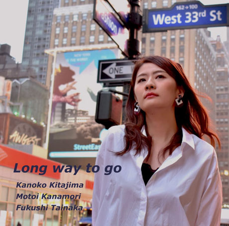 | 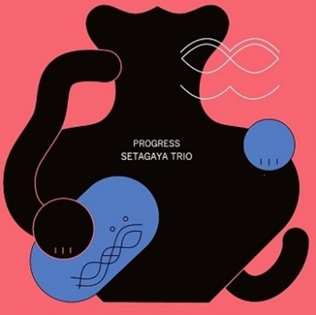 | 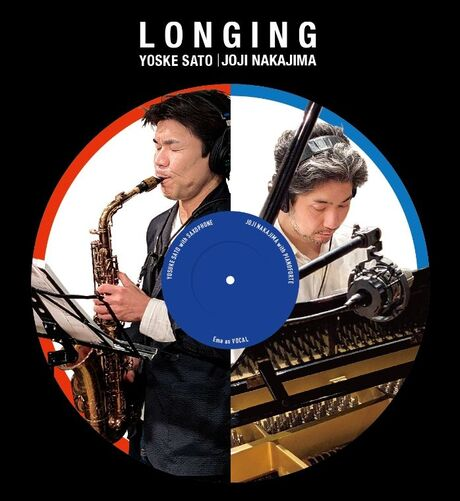
 | 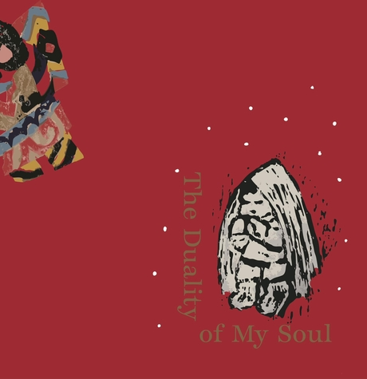 | 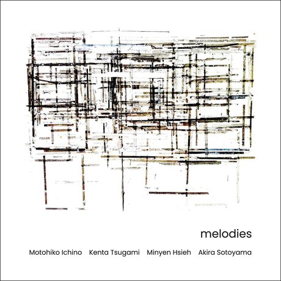
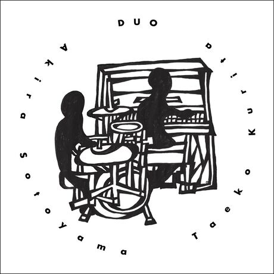 | 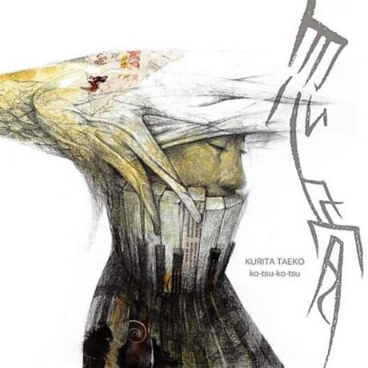 | 

---

## Audio Mix #20

<audio controls>
<source src="./audio/compilation-20.mp3" type="audio/mpeg">
Your browser does not support the audio element.
</audio>

1.  “A Goat Climbs a Peak” - [Ghost Peak: *The Goat on a Peak*](https://www.jazzofjapan.com/p/ghost-peak-goat-on-a-peak) - 00:00
2.  “The Laughing Stock” - [Hikari Ichihara Group: *Unity*](https://www.jazzofjapan.com/p/hikari-ichihara-group-unity) - 03:13
3.  “Arrakis” - [Hitomi Nishiyama: *Echo*](https://www.jazzofjapan.com/p/hitomi-nishiyama-echo) - 06:22
4.  “I’m Missing You” - [Hitomi Nishiyama Trio: *I’m Missing You*](https://www.jazzofjapan.com/p/hitomi-nishiyama-trio-im-missing-you) - 09:59
5.  “Sheepwash” - [Fe: *Live at Virtuoso*](https://www.jazzofjapan.com/p/fe-live-at-virtuoso) - 13:06
6.  “Spring Is Here” - [Akane Matsumoto & Ayumi Koketsu: *Trust*](https://www.jazzofjapan.com/p/akane-matsumoto-ayumi-koketsu-trust) - 16:26
7.  “Barubaro” - [Kaito Nakamura: *Invisible Diary*](https://www.jazzofjapan.com/p/kaito-nakamura-invisible-diary) - 19:55
8.  “Ai San San” - [Shinya Fukumori Trio: *For 2 Akis*](https://www.jazzofjapan.com/p/shinya-fukumori-trio-for-2-akis) - 22:54
9.  “Stolen Moments” - [Layla Tomomi Sakai: *Stolen Moments*](https://www.jazzofjapan.com/p/layla-tomomi-sakai-stolen-moments) - 26:11

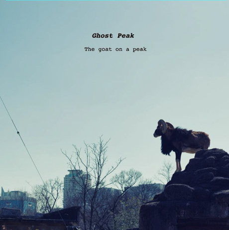 | 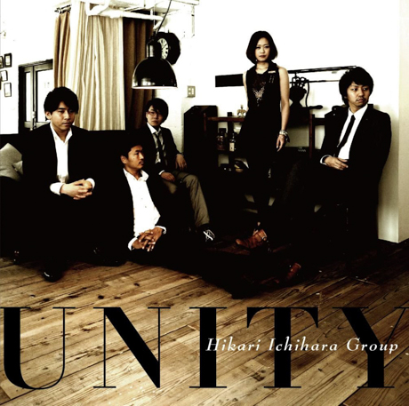 | 
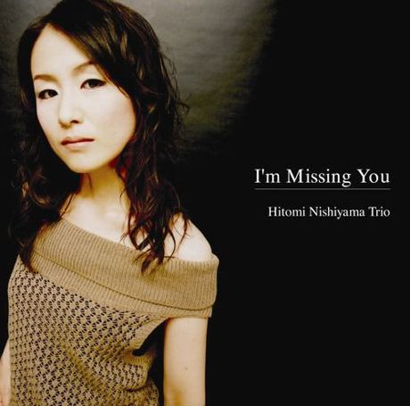 |  | 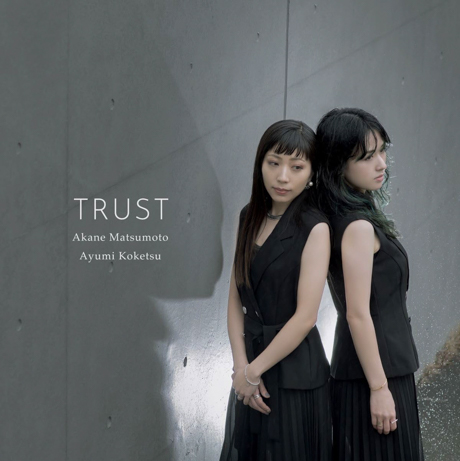
 | 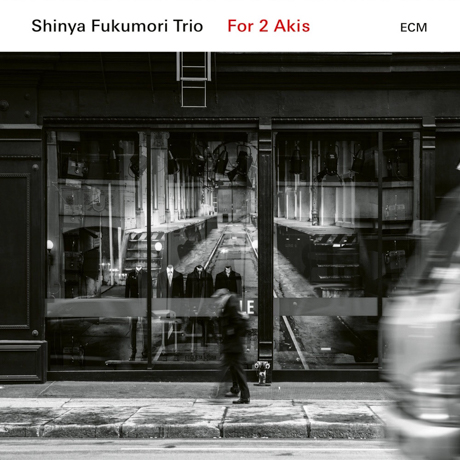 | 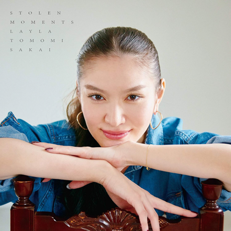

---

## Audio Mix #19

<audio controls>
<source src="./audio/compilation-19.mp3" type="audio/mpeg">
Your browser does not support the audio element.
</audio>

1.  “Nostalgio” - [Megumi Yonezawa / Masa Kamaguchi / Ken Kobayashi: *Boundary*](https://www.jazzofjapan.com/p/megumi-yonezawa-masa-kamaguchi-ken-kobayashi-boundary) - 00:00
2.  “Owari to Hajimari” - [Nobie & Takayoshi Baba: *Owari to Hajimari*](https://www.jazzofjapan.com/p/nobie-takayoshi-baba-owari-to-hajimari) - 03:38
3.  “Wunderbarland” - [Daiki Yasukagawa New Trio: *The Three Roses*](https://www.jazzofjapan.com/p/daiki-yasukagawa-new-trio-three-roses) - 06:50
4.  “Autumn Leaves” - [Motoi Kanamori: *The Live*](https://www.jazzofjapan.com/p/motoi-kanamori-the-live) - 10:12
5.  “Short Stories No. 6” - [Magnolia: *El viento y las flores*](https://www.jazzofjapan.com/p/magnolia-el-viento-y-las-flores) - 13:15
6.  “Flip a Coin” - [Miyuki Moriya: *Beyond the Sea*](https://www.jazzofjapan.com/p/miyuki-moriya-beyond-the-sea) - 15:48
7.  “Voltex” - [Ami Fukui Trio: *MCY*](https://www.jazzofjapan.com/p/ami-fukui-trio-mcy) - 19:21
8.  “Hanauta” - [Hideaki Hori & Wataru Hamasaki: *Encounter*](https://www.jazzofjapan.com/p/hideaki-hori-wataru-hamasaki-encounter) - 22:34
9.  “Poinciana” - [Emiko Voice & Yuka Yanagihara: *Enyana*](https://www.jazzofjapan.com/p/emiko-voice-yuka-yanagihara-enyana) - 26:04

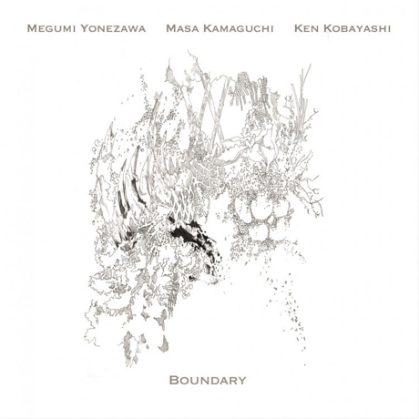 | 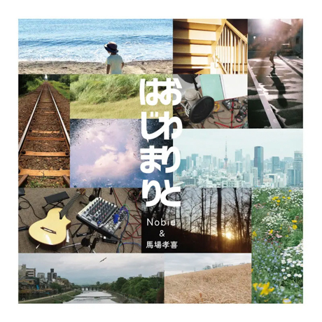 | 
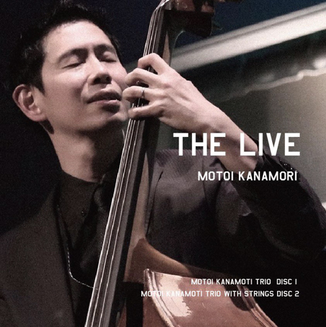 |  | 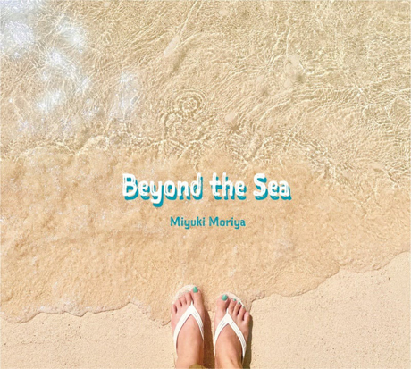
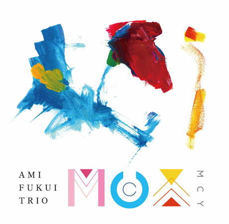 | 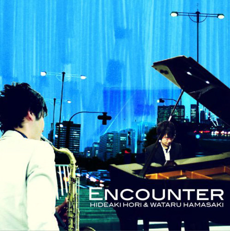 | 

---

## Audio Mix #18

<audio controls>
<source src="./audio/compilation-18.mp3" type="audio/mpeg">
Your browser does not support the audio element.
</audio>

1.  “Vain Pursuit” - [Chie Nishimura: *Virtual Silence*](https://www.jazzofjapan.com/p/chie-nishimura-virtual-silence) - 00:00
2.  “Siciliano” - [Makiyo Sakai: *Silver Painting*](https://www.jazzofjapan.com/p/makiyo-sakai-silver-painting) - 03:10
3.  “Slumber” - [Ryosuke Hashizume Group: *Side Two*](https://www.jazzofjapan.com/p/ryosuke-hashizume-group-side-two) - 06:27
4.  “Ringlight” - [Fumie Chiba: *Rougequeue*](https://www.jazzofjapan.com/p/fumie-chiba-rougequeue) - 09:44
5.  “Snowflake” - [Yuka Yanagihara Trio: *Beloved Ones*](https://www.jazzofjapan.com/p/yuka-yanagihara-trio-beloved-ones) - 12:16
6.  “Makoto no Kotoba” - [Seiji Endo: *Piano Pieces Collection*](https://www.jazzofjapan.com/p/seiji-endo-piano-pieces-collection) - 15:27
7.  “Erica” - [Seiji Endo: *Piano Pieces Collection II*](https://www.jazzofjapan.com/p/seiji-endo-piano-pieces-collection-ii) - 16:50
8.  “Updraft” - [Hiro Kimura: *Trees*](https://www.jazzofjapan.com/p/hiro-kimura-trees) - 20:42
9.  “Oh Lady Be Good” - [Akane Matsumoto: *Oh, Lady Be Good*](https://www.jazzofjapan.com/p/akane-matsumoto-oh-lady-be-good) - 24:22

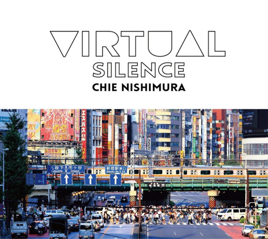 |  | 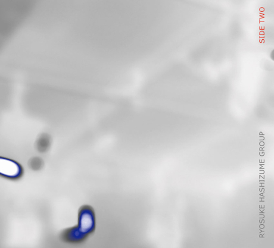
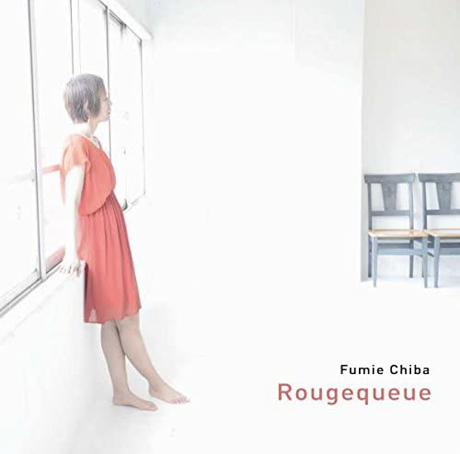 | 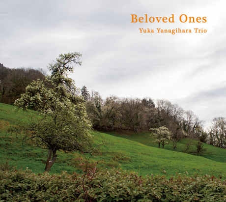 | 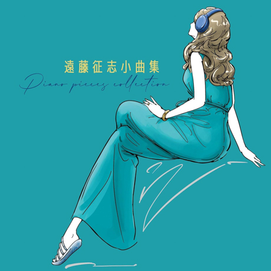
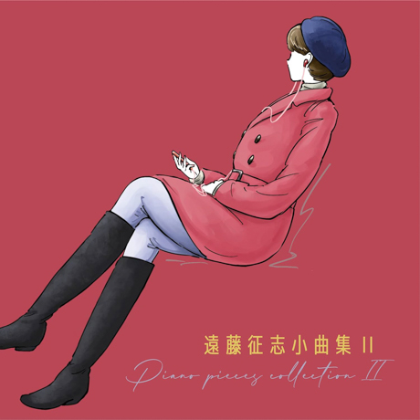 |  | 

---

## Audio Mix #17

<audio controls>
<source src="./audio/compilation-17.mp3" type="audio/mpeg">
Your browser does not support the audio element.
</audio>

1.  “May Song” - [Koichi Sato: *Embryo*](https://www.jazzofjapan.com/p/koichi-sato-embryo) - 00:00
2.  “Blues” - [Yasumasa Kumagai & Ryu Kawamura: *Ol’ School Jazz*](https://www.jazzofjapan.com/p/yasumasa-kumagai-ryu-kawamura-ol-school-jazz) - 03:01
3.  “Loop” - [Nobie: *Primary*](https://www.jazzofjapan.com/p/nobie-primary) - 05:24
4.  “I Miss the Blue Sky” - [Sayaka Kishi Trio: *Banquet*](https://www.jazzofjapan.com/p/sayaka-kishi-trio-banquet) - 08:36
5.  “Ibuki” - [Clepsydra: *Un Jour*](https://www.jazzofjapan.com/p/clepsydra-un-jour) - 11:46
6.  “Grand Line” - [Sumire Kuribayashi Trio: *Toys*](https://www.jazzofjapan.com/p/sumire-kuribayashi-trio-toys) - 16:42
7.  “The Rider” - [Hitomi Nishiyama: *Dot*](https://www.jazzofjapan.com/p/hitomi-nishiyama-dot) - 19:20
8.  “Chatchar” - [Mamoru Ishida: *Afterglow*](https://www.jazzofjapan.com/p/mamoru-ishida-afterglow) - 22:44
9.  “True Face” - [Mabumi Yamaguchi: *Viento*](https://www.jazzofjapan.com/p/mabumi-yamaguchi-viento) - 26:59

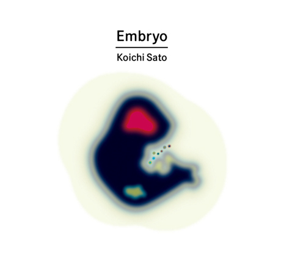 |  | 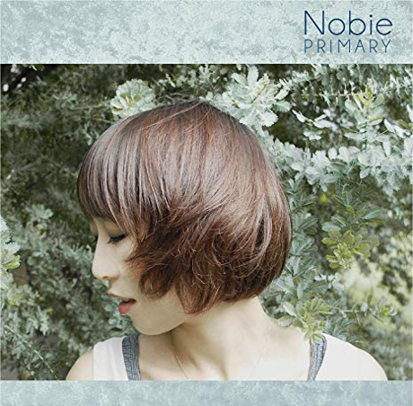
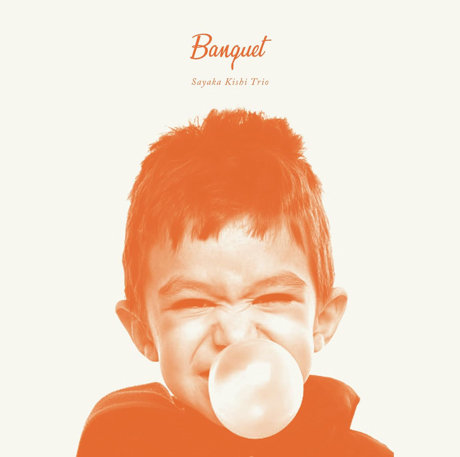 | 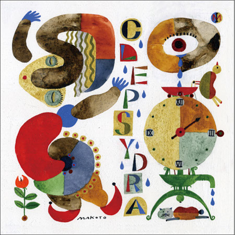 | 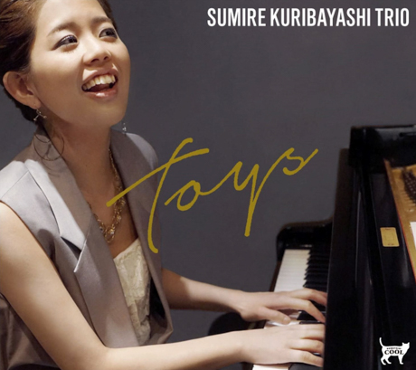
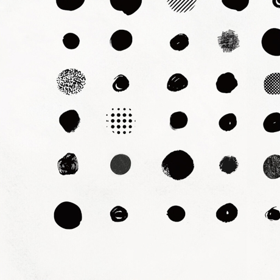 |  | 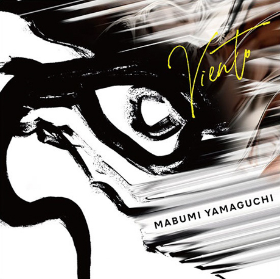

---

## Audio Mix #16

<audio controls>
<source src="./audio/compilation-16.mp3" type="audio/mpeg">
Your browser does not support the audio element.
</audio>

1.  “Vibrant Line” - [Reiko Yamamoto: *The Square Pyramid*](https://www.jazzofjapan.com/p/reiko-yamamoto-square-pyramid) - 00:00
2.  “Nature Boy” - [Yuki Ito: *Retattanni no Mori*](https://www.jazzofjapan.com/p/yuki-ito-retattanni-no-mori) - 03:23
3.  “Saenk kun dit hoved du blomst” - [Kazumi Ikenaga & Taihei Asakawa: *NordNote*](https://www.jazzofjapan.com/p/kazumi-ikenaga-taihei-asakawa-nordnote) - 06:15
4.  “Sara Smile” - [Hikari Ichihara: *Sara Smile*](https://www.jazzofjapan.com/p/hikari-ichihara-sara-smile) - 08:40
5.  “Mokume #1” - [Akihiro Yoshimoto & Takashi Sugawa: *Oxymoron*](https://www.jazzofjapan.com/p/akihiro-yoshimoto-takashi-sugawa-oxymoron) - 12:05
6.  “Wrapped Up” - [Motohiko Ichino: *Sketches*](https://www.jazzofjapan.com/p/motohiko-ichino-sketches) - 14:35
7.  “I Will Wait for You” - [Yoshiko Saita: *Back in Time to Boston*](https://www.jazzofjapan.com/p/yoshiko-saita-back-in-time-to-boston) - 17:38
8.  “The Sea Seven Years Voyage” - [Eri Chichibu: *Crossing Reality*](https://www.jazzofjapan.com/p/eri-chichibu-crossing-reality) - 20:47
9.  “Neste Pais” - [Banda Feliz: *Boa Viagem*](https://www.jazzofjapan.com/p/banda-feliz-boa-viagem) - 23:46

 | 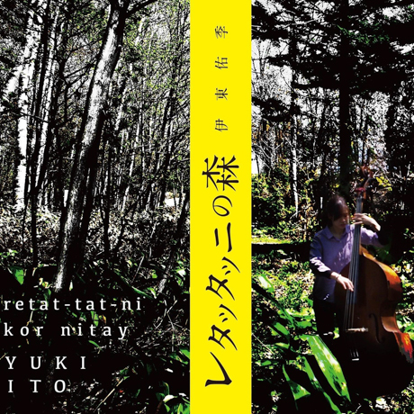 | 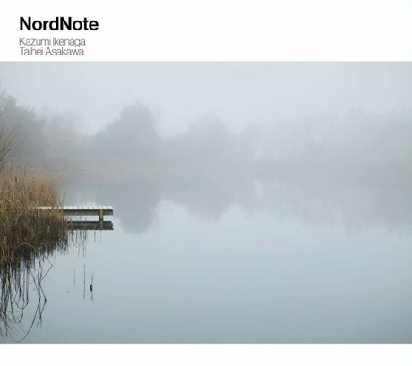
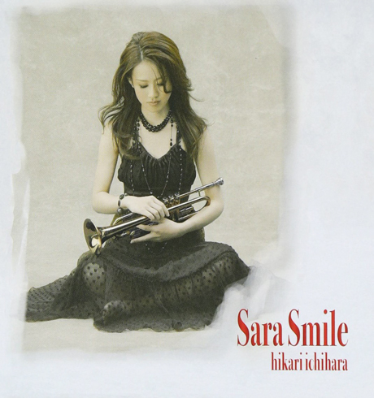 | 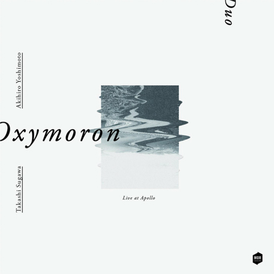 | 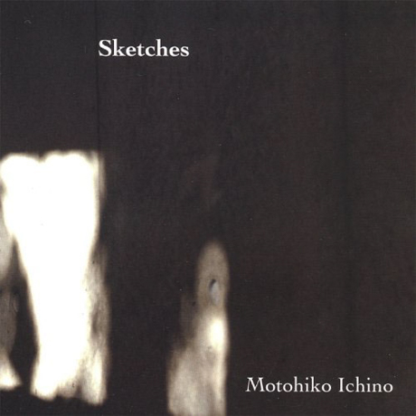
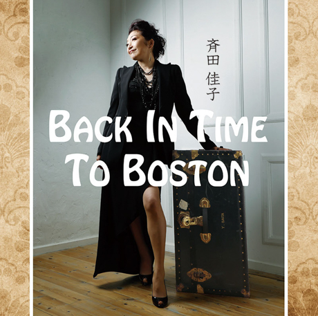 | 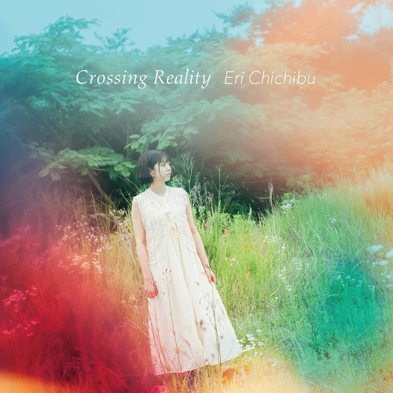 | 

---

## Audio Mix #15

<audio controls>
<source src="./audio/compilation-15.mp3" type="audio/mpeg">
Your browser does not support the audio element.
</audio>

1.  “Mysterious Dress” - [Jabuticaba: *Jabuticaba*](https://www.jazzofjapan.com/p/jabuticaba-jabuticaba) - 00:00
2.  “Le Bourgeon” - [Nami Kano: *Mawsim*](https://www.jazzofjapan.com/p/nami-kano-mawsim) - 02:20
3.  “Savichara” - [eFreydut: *Fairway*](https://www.jazzofjapan.com/p/efreydut-fairway) - 04:39
4.  “Loudvik” - [Hitomi Nishiyama Trio: *Calling*](https://www.jazzofjapan.com/p/hitomi-nishiyama-trio-calling) - 06:38
5.  “Frozen Dust” - [Takumi Seino & Motohiko Ichino: *Frozen Dust*](https://www.jazzofjapan.com/p/takumi-seino-motohiko-ichino-frozen-dust) - 09:46
6.  “Yakusoku” - [Noriko Satomi: *Project-N*](https://www.jazzofjapan.com/p/noriko-satomi-project-n) - 12:52
7.  “Punk” - [Erisa Ogawa: *Where Have U Been?*](https://www.jazzofjapan.com/p/erisa-ogawa-where-have-u-been) - 16:12
8.  “Narrow and Wide” - [Otohito Fuse Trio: *Isolated*](https://www.jazzofjapan.com/p/otohito-fuse-trio-isolated) - 18:46
9.  “Desifinado” - [Miwo: *Tranquillo*](https://www.jazzofjapan.com/p/miwo-tranquillo) - 21:49

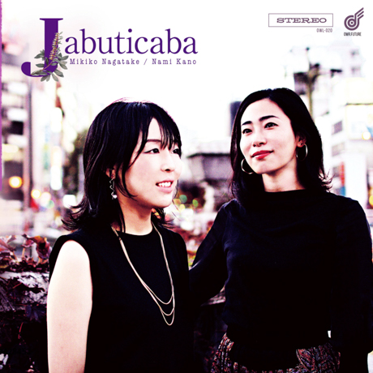 | 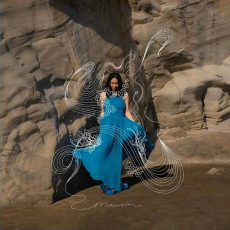 | 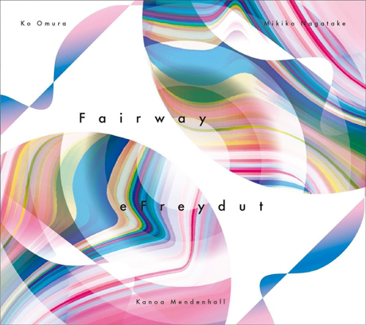
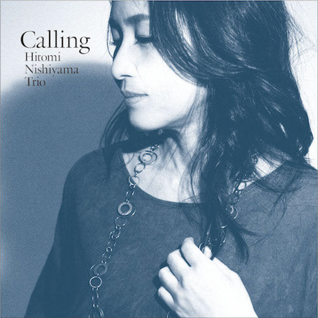 | 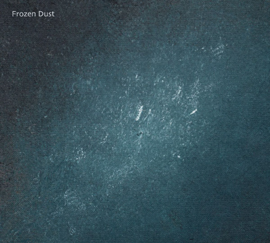 | 
 | 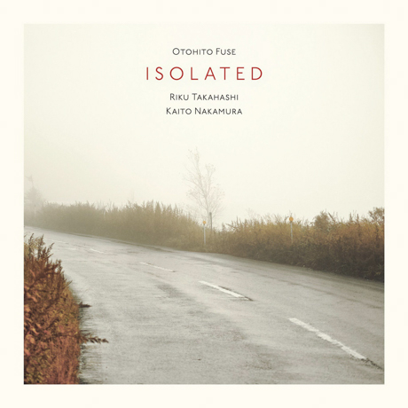 | 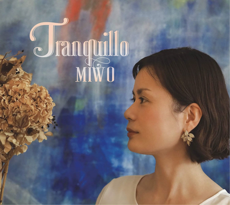

---

## Audio Mix #14

<audio controls>
<source src="./audio/compilation-14.mp3" type="audio/mpeg">
Your browser does not support the audio element.
</audio>

1.  “J” - [Kaoru Azuma / Hitomi Nishiyama: *Faces*](https://www.jazzofjapan.com/p/kaoru-azuma-hitomi-nishiyama-faces) - 00:00
2.  “First Contact” - [Mase Hiroko Quintet: *First Contact*](https://www.jazzofjapan.com/p/mase-hiroko-quintet-first-contact) - 02:25
3.  “After Tours” - [Yuka Yanagihara Trio: *Inner Views*](https://www.jazzofjapan.com/p/yuka-yanagihara-trio-inner-views) - 04:43
4.  “Sense of Mission” - [Keisuke Nakamura: *Humadope 2*](https://www.jazzofjapan.com/p/keisuke-nakamura-humadope-2) - 07:24
5.  “Hommage” - [Ami Fukui Trio: *Nova Manhã*](https://www.jazzofjapan.com/p/ami-fukui-trio-nova-manha) - 10:03
6.  “825” - [Polyglot: *Talk, Vol. 1*](https://www.jazzofjapan.com/p/polyglot-talk-vol-1) - 12:08
7.  “Minor King” - [Hiroshi Fukutomi: *Memory Stones*](https://www.jazzofjapan.com/p/hiroshi-fukutomi-memory-stones) - 15:16
8.  “Quand Biron Voulut Danser” - [Chihiro Yamanaka: *Lach Doch Mal*](https://www.jazzofjapan.com/p/chihiro-yamanaka-lach-doch-mal) - 17:35
9.  “M.T.” - [Naoko Tanaka: *Appreciation*](https://www.jazzofjapan.com/p/naoko-tanaka-appreciation) - 19:32

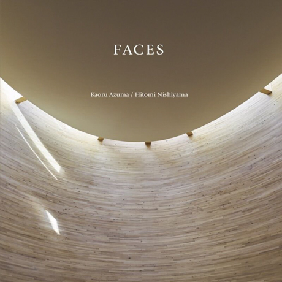 | 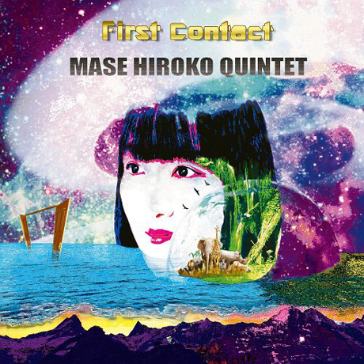 | 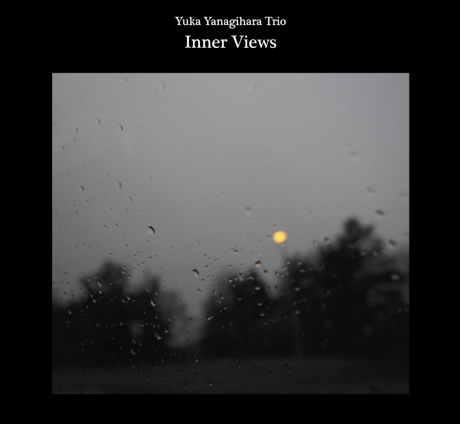
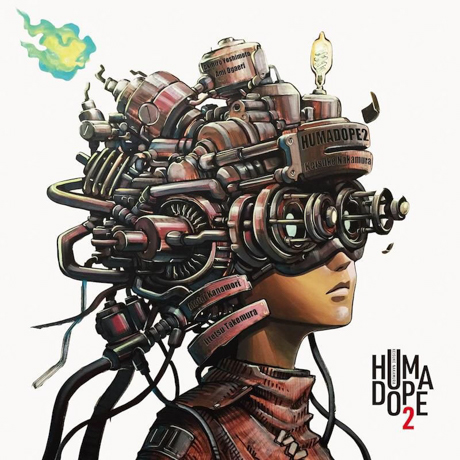 | 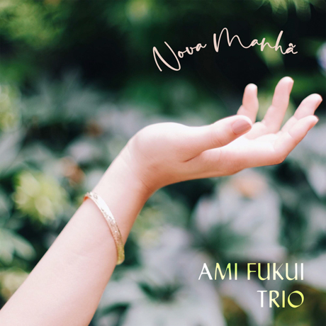 | 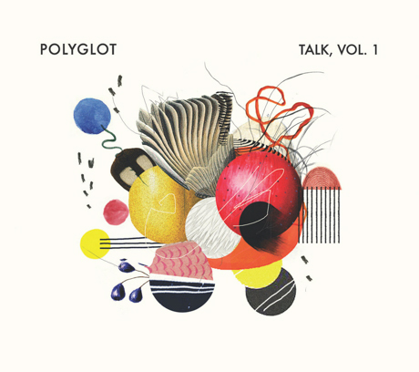
 | 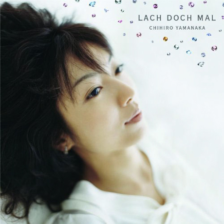 | 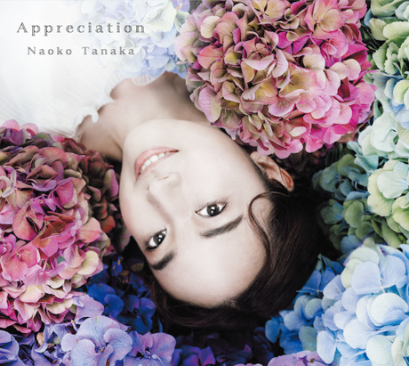

---

## Audio Mix #13

<audio controls>
<source src="./audio/compilation-13.mp3" type="audio/mpeg">
Your browser does not support the audio element.
</audio>

1.  “Hi no Kodomotachi” - [Rabbitoo: *The Torch*](https://www.jazzofjapan.com/p/rabbitoo-the-torch) - 00:00
2.  “Through the Lights” - [Kaori Vibes Quartet: *Starry Nights*](https://www.jazzofjapan.com/p/kaori-vibes-quartet-starry-nights) - 02:34
3.  “Plus fort que nous” - [Shinpei Ruike & George Nakajima: *Duo*](https://www.jazzofjapan.com/p/shinpei-ruike-george-nakajima-duo) - 04:37
4.  “Laurentide Waltz” - [Akane Matsumoto: *Little Girl Blue*](https://www.jazzofjapan.com/p/akane-matsumoto-little-girl-blue) - 06:51
5.  “1965” - [Nanami Haruta: *II*](https://www.jazzofjapan.com/p/nanami-haruta-ii) - 08:48
6.  “Sliding Doors” - [Hideaki Hori: *Horizon*](https://www.jazzofjapan.com/p/hideaki-hori-horizon) - 11:18
7.  “A Song for U U” - [Hideaki Hori: *Melodies for Night & Day*](https://www.jazzofjapan.com/p/hideaki-hori-melodies-for-night-day) - 13:37
8.  “Uta Oto” - [Miyuki Moriya: *Uta Oto*](https://www.jazzofjapan.com/p/miyuki-moriya-uta-oto) - 15:36
9.  “My Favorite Things” - [Baby Brothers: *Happy Christmas with Bb*](https://www.jazzofjapan.com/p/baby-brothers-happy-christmas-with-bb) - 18:09

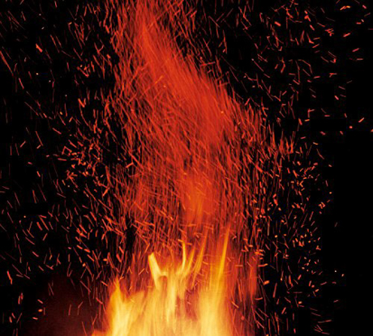 |  | 
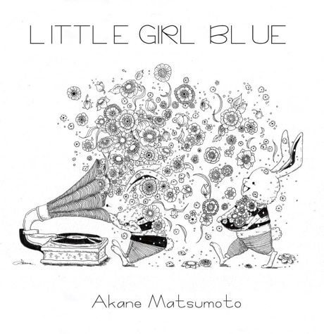 |  | 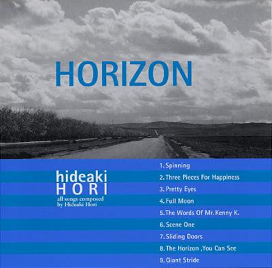
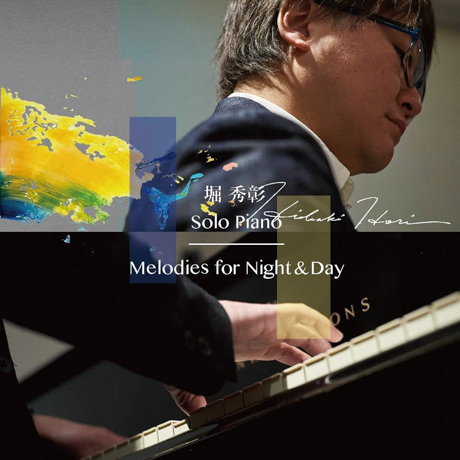 | 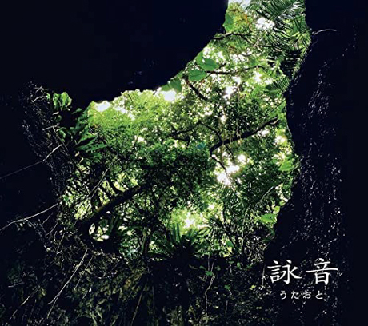 | 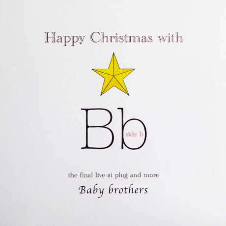

---

## Audio Mix #12

<audio controls>
<source src="./audio/compilation-12.mp3" type="audio/mpeg">
Your browser does not support the audio element.
</audio>

1.  “No Return” - [Yuichi Narita: *Urban Nocturne*](https://www.jazzofjapan.com/p/yuichi-narita-urban-nocturne) - 00:00
2.  “Primavera de Batata” - [Sul Madrugada: *Luar*](https://www.jazzofjapan.com/p/sul-madrugada-luar) - 01:28
3.  “Catherine no Yuutsu” - [Yukako Yamano: *Imperial*](https://www.jazzofjapan.com/p/yukako-yamano-imperial) - 03:31
4.  “Fifteen Years” - [Bungalow: *Abstract Messages*](https://www.jazzofjapan.com/p/bungalow-abstract-messages) - 06:05
5.  “Hashire Hashire Merosu” - [FNK: *Canvas*](https://www.jazzofjapan.com/p/fnk-canvas) - 08:09
6.  “McMahons Point” - [Mamoru Ishida: *Ishida Mamoru 4 feat. Mike Rivett*](https://www.jazzofjapan.com/p/mamoru-ishida-ishida-mamoru-4-feat) - 10:49
7.  “Green Chimneys” - [Mikiko Nagatake: *Solo*](https://www.jazzofjapan.com/p/mikiko-nagatake-solo) - 12:57
8.  “Apologetic Blues” - [Yasumasa Kumagai & J-Jazz Homies: *Last Resort*](https://www.jazzofjapan.com/p/yasumasa-kumagai-last-resort) - 14:37
9.  “Chovendo na Roseira” - [Emiko Voice: *Standard Trio*](https://www.jazzofjapan.com/p/emiko-voice-standard-trio) - 16:57

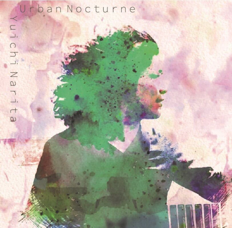 | 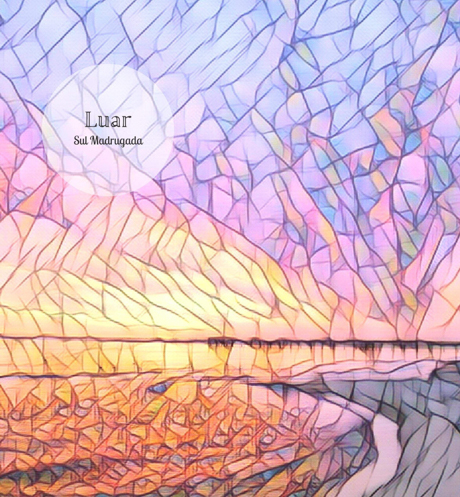 | 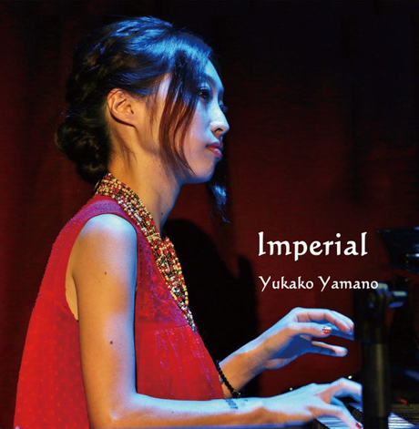
 | 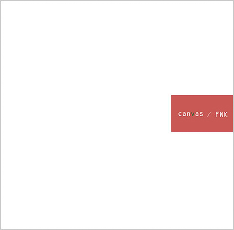 | 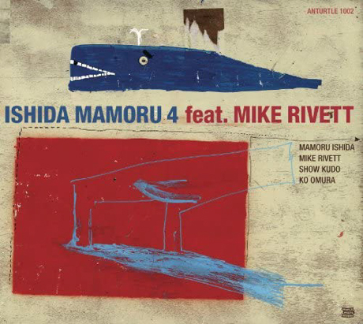
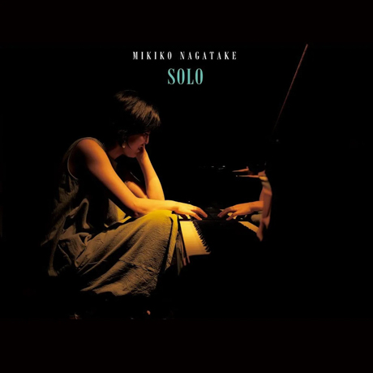 |  | 

---

## Audio Mix #11

<audio controls>
<source src="./audio/compilation-11.mp3" type="audio/mpeg">
Your browser does not support the audio element.
</audio>

1.  “Frida” - [Mariko Maeda: *Awareness*](https://www.jazzofjapan.com/p/mariko-maeda-awareness) - 00:00
2.  “Face to Face” - [Hiro Kimura Quintet: *Folds*](https://www.jazzofjapan.com/p/hiro-kimura-quintet-folds) - 01:42
3.  “Recollection” - [Hitomi Nishiyama: *Vibrant*](https://www.jazzofjapan.com/p/hitomi-nishiyama-vibrant) - 03:46
4.  “Sepia” - [Yuichiro Aratake: *Music Make Us One*](https://www.jazzofjapan.com/p/yuichiro-aratake-music-make-us-one) - 05:48
5.  “Funny Book” - [Akihiro Yoshimoto Quartet: *64 Charlesgate*](https://www.jazzofjapan.com/p/akihiro-yoshimoto-quartet-64-charlesgate) - 08:16
6.  “I’ve Never Been in Love Before” - [Seiji Harakawa Quartet: *Skipping Down the Street*](https://www.jazzofjapan.com/p/seiji-harakawa-quartet-skipping-down) - 09:60
7.  “Please Send Me Someone to Love” - [Akane Matsumoto & Nanami Haruta: *For My Lady*](https://www.jazzofjapan.com/p/akane-matsumoto-nanami-haruta-for) - 12:03
8.  “Conversations With Moore” - [Ryosuke Hashizume Group: *Acoustic Fluid*](https://www.jazzofjapan.com/p/ryosuke-hashizume-group-acoustic) - 14:43
9.  “Triste” - [Fumika Asari: *Introducin’*](https://www.jazzofjapan.com/p/fumika-asari-introducin) - 17:15
10. “Inori” - [Tetsuji Yoshida & Mikiko Nagatake Duo: *Live at Knuttel House*](https://www.jazzofjapan.com/p/tetsuji-yoshida-and-mikiko-nagatake) - 19:18

 | 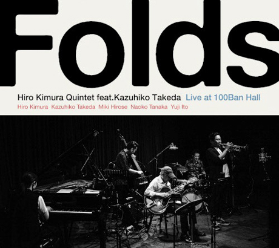 | 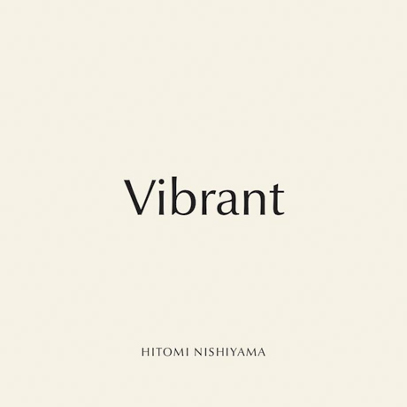
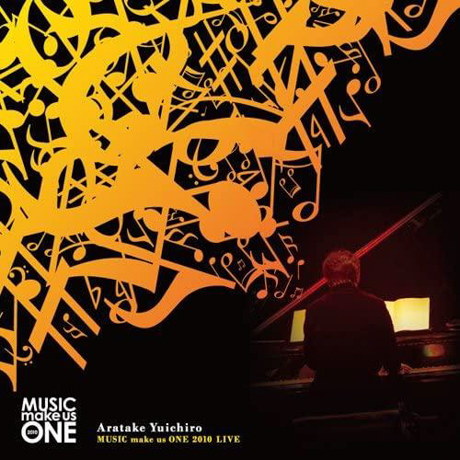 | 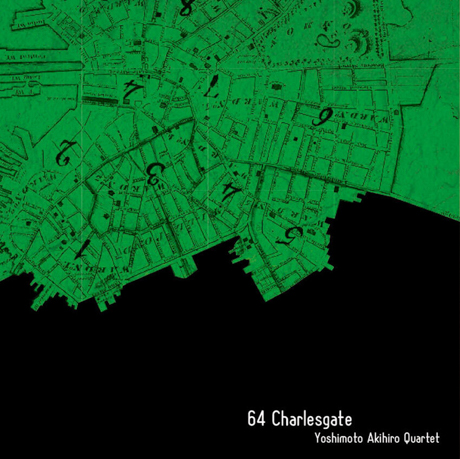 | 
 | 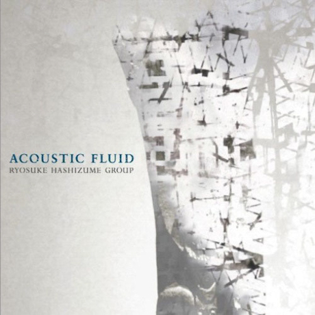 | 
 |   |  

---

## Audio Mix #10

<audio controls>
<source src="./audio/compilation-10.mp3" type="audio/mpeg">
Your browser does not support the audio element.
</audio>

1.  “Zai Jian” - [Ami Fukui Trio: *Urban Clutter*](https://www.jazzofjapan.com/p/ami-fukui-trio-urban-clutter) - 00:00
2.  “Victory” - [Yukako Yamano & Yukari Inoue: *Dubai Suite*](https://www.jazzofjapan.com/p/yukakoyamano-yukariinoue-dubai) - 02:48
3.  “Dancing Elephant” - [Bungalow: *Unseen Scenes*](https://www.jazzofjapan.com/p/bungalow-unseen-scenes) - 04:32
4.  “My Shining Hour” - [Harumi Nomoto Trio: *Another Ordinary Day*](https://www.jazzofjapan.com/p/harumi-nomoto-trio-another-ordinary-day) - 06:35
5.  “Luna” - [Yukako Yamano: *3rd Stage*](https://www.jazzofjapan.com/p/yukako-yamano-3rd-stage) - 08:08
6.  “Choir’s Got Fired” - [Yasumasa Kumagai: *Pray*](https://www.jazzofjapan.com/p/yasumasa-kumagai-pray) - 10:11
7.  “Outside by the Swing” - [Chihiro Yamanaka: *Outside by the Swing*](https://www.jazzofjapan.com/p/chihiro-yamanaka-outside-by-the-swing) - 12:44
8.  “Fly Me to the Moon” - [Naoko Akimoto: *No One Else*](https://www.jazzofjapan.com/p/naoko-akimoto-no-one-else) - 13:47
9.  “I Can’t Fly” - [Shunichi Yanagi Trio: *Slope*](https://www.jazzofjapan.com/p/shunichi-yanagi-trio-slope) - 15:31
10. “A Foggy Day” - [Rie Taguchi: *The Gift II*](https://www.jazzofjapan.com/p/rie-taguchi-the-gift-ii) - 17:35
11. “First Touch” - [George Nakajima Trio: *First Touch*](https://www.jazzofjapan.com/p/george-nakajima-trio-first-touch) - 19:16

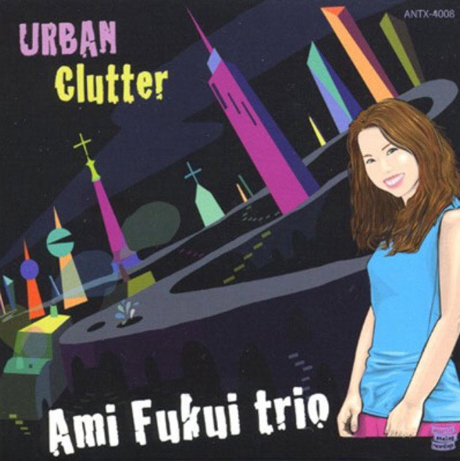 |  | 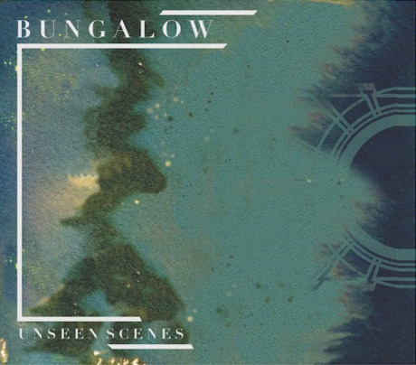
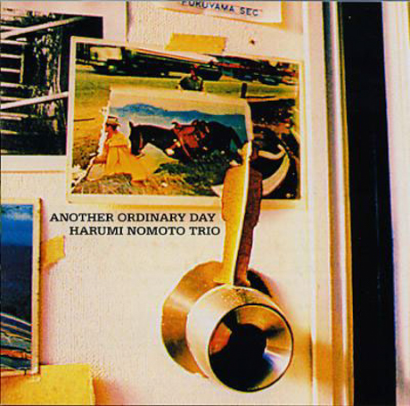 | 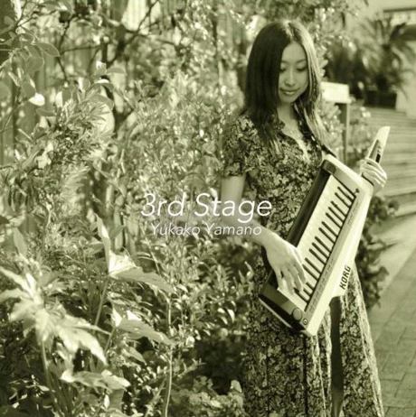 | 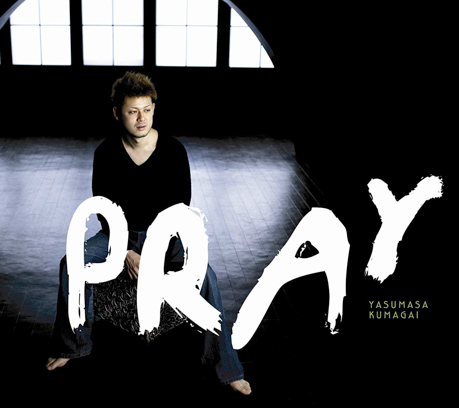
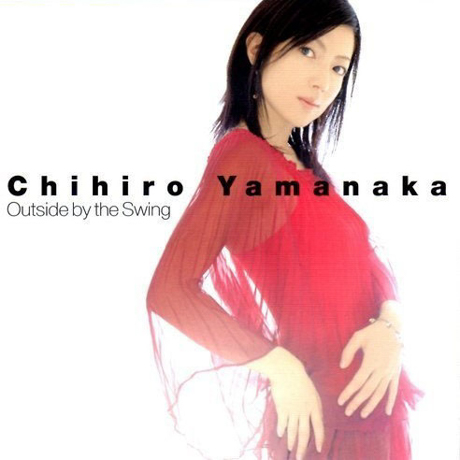 | 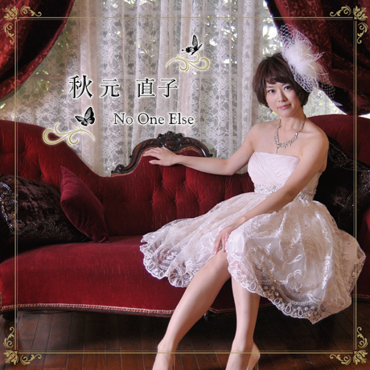 | 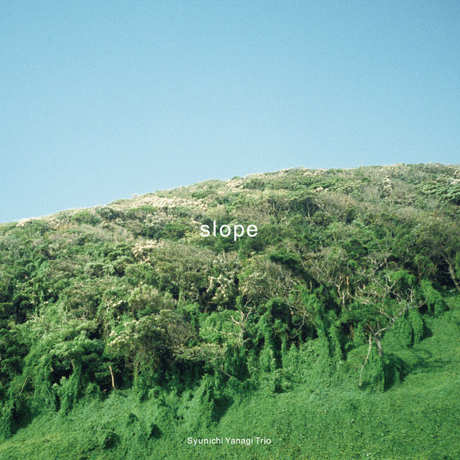
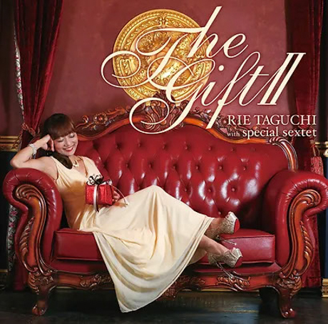 | 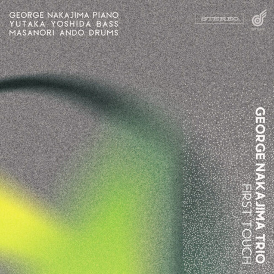 |  

---

## Audio Mix #9

<audio controls>
<source src="./audio/compilation-9.mp3" type="audio/mpeg">
Your browser does not support the audio element.
</audio>

1.  “JB’s Poem” - [Yoshihito “P” Koizumi P-Project: *By Coincidence*](https://www.jazzofjapan.com/p/yoshihito-p-koizumi-by-coincidence) - 00:00
2.  “Mane” - [Naoko Sakata Trio: *Flower Clouds*](https://www.jazzofjapan.com/p/naoko-sakata-trio-flower-clouds) - 01:03
3.  “Water Drops” - [Fumie Chiba: *Beautiful Days*](https://www.jazzofjapan.com/p/fumie-chiba-beautiful-days) - 03:07
4.  “Dona Dona” - [Fumiko Yamazaki: *Here Goes!*](https://www.jazzofjapan.com/p/fumiko-yamazaki-here-goes) - 05:13
5.  “Old Diary” - [Shinichi Kato & Masahiko Sato: *Duet*](https://www.jazzofjapan.com/p/shinichi-kato-and-masahiko-sato-duet) - 07:17
6.  “How Deep Is the Ocean” - [Shigeo Fukuda & Toshiki Nunokawa: *Childhood’s Dream*](https://www.jazzofjapan.com/p/shigeo-fukuda-and-toshiki-nunokawa) - 09:21
7.  “The Last Train” - [Protean: *Protean*](https://www.jazzofjapan.com/p/protean-protean) - 11:25
8.  “Sai Dessa” - [Meu Coracao: *Hall Tone*](https://www.jazzofjapan.com/p/meu-coracao-hall-tone) - 12:58
9.  “Goteborg” - [Toshihiko Inoue & Masaki Hayashi: *Mistral*](https://www.jazzofjapan.com/p/toshihiko-inoue-and-masaki-hayashi) - 14:32
10. “It Might as Well Be Spring” - [Trigraph: *Fever*](https://www.jazzofjapan.com/p/trigraph-fever) - 16:36
11. “Nuovo Cinema Paradiso” - [Ruriko Kawamura: *Blossoms*](https://www.jazzofjapan.com/p/ruriko-kawamura-blossoms) - 18:49

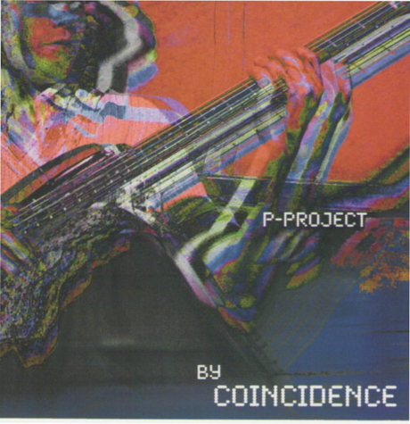 | 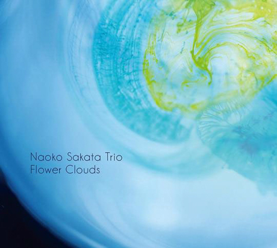 | 
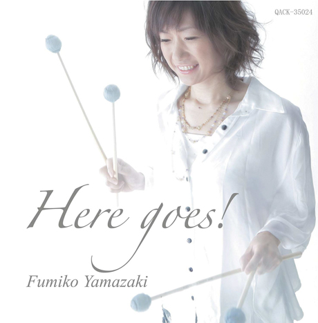 | 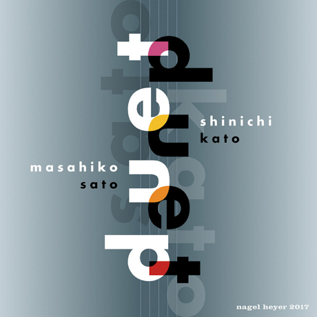 | 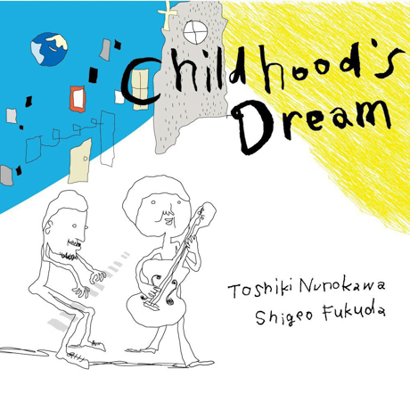
 | 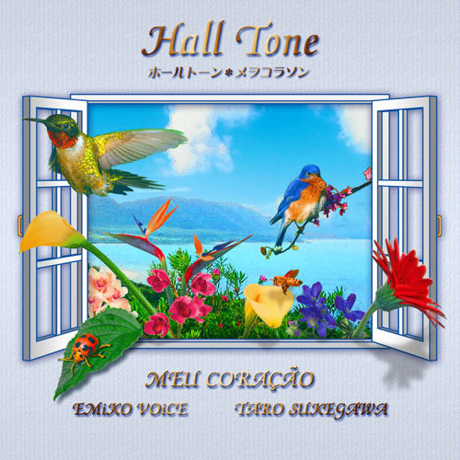 | 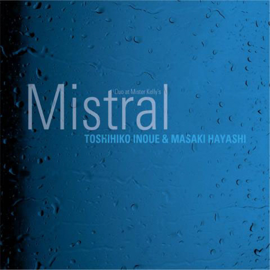
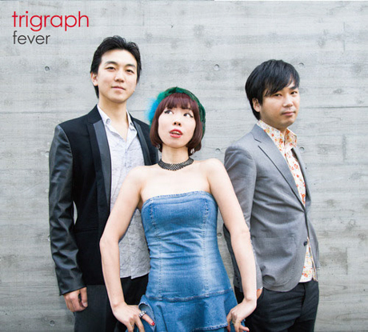 | 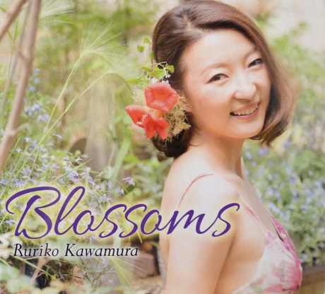 |  

---

## Audio Mix #8

<audio controls>
<source src="./audio/compilation-8.mp3" type="audio/mpeg">
Your browser does not support the audio element.
</audio>

1.  “For All We Know” - [Masako Kunisada: *Wonderful Life*](https://www.jazzofjapan.com/p/masako-kunisada-wonderful-life) - 00:00
2.  “Street Lights” - [Aquapit: *Aquapit*](https://www.jazzofjapan.com/p/aquapit-aquapit) - 01:27
3.  “Sailing” - [Naoko Tanaka Trio: *Memories*](https://www.jazzofjapan.com/p/naoko-tanaka-trio-memories) - 02:30
4.  “G Island” - [TCQ: *Memories of T*](https://www.jazzofjapan.com/p/tcq-memories-of-t) - 03:54
5.  “Memories of You” - [Akane Matsumoto: *Memories of You*](https://www.jazzofjapan.com/p/akane-matsumoto-memories-of-you) - 04:57
6.  “Kyoto Tower” - [Takayuki Yagi: *New Departure*](https://www.jazzofjapan.com/p/takayuki-yagi-new-departure) - 06:20
7.  “Scratch” - [Miki Hirose: *Scratch*](https://www.jazzofjapan.com/p/miki-hirose-scratch) - 07:23
8.  “Meu Escudo” - [Yuka Ueda: *Dois*](https://www.jazzofjapan.com/p/yuka-ueda-dois) - 08:26
9.  “Satin Doll” - [Water Me!: *Water Me!*](https://www.jazzofjapan.com/p/water-me-water-me) - 09:44
10. “Choro de Tremolo” - [Duo Tremolo: *Resonance*](https://www.jazzofjapan.com/p/duo-tremolo-resonance) - 11:05
11. “Whisper Not” - [Layla Tomomi Sakai: *Whisper Not*](https://www.jazzofjapan.com/p/layla-tomomi-sakai-whisper-not) - 12:08
12. “Living Time Event V” - [Chihiro Yamanaka Trio: *Madrigal*](https://www.jazzofjapan.com/p/chihiro-yamanaka-trio-madrigal) - 13:14
13. “Libertango” - [Arco: *Live At Yoncha*](https://www.jazzofjapan.com/p/arco-live-at-yoncha) - 14:17
14. “Mirage” - [Yukiko Hayakawa Trio: *Gallery*](https://www.jazzofjapan.com/p/yukiko-hayakawa-trio-gallery) - 15:35

 | 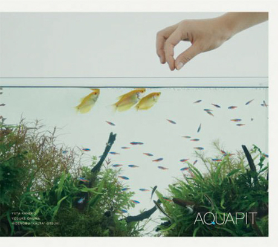 | 
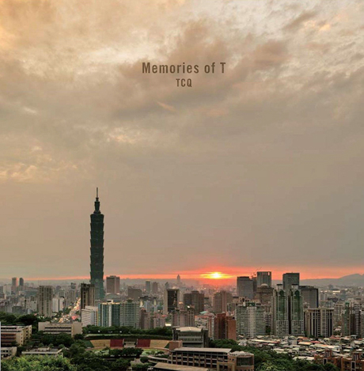 | 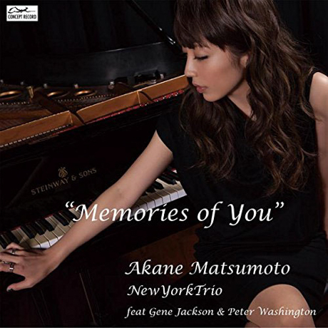 | 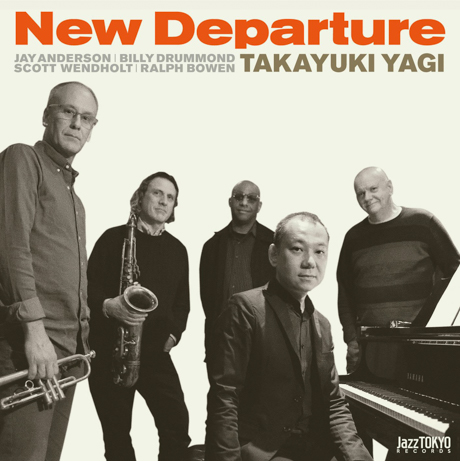
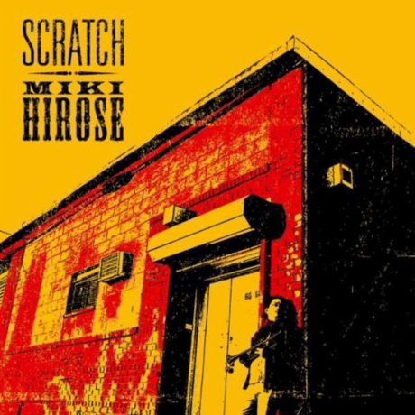 | 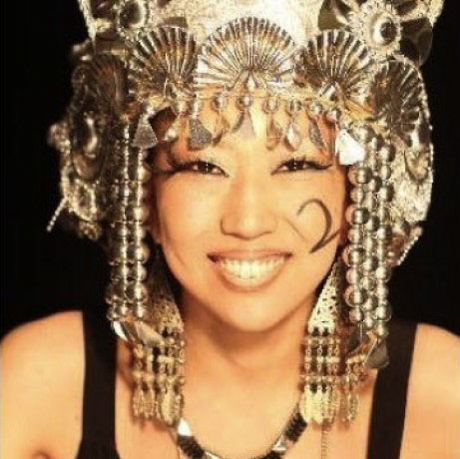 | 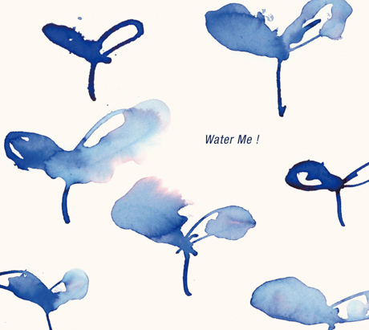
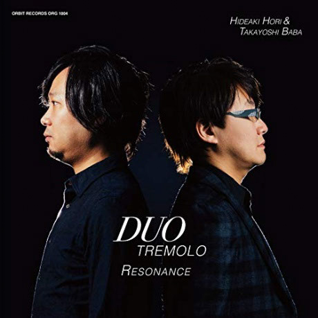 | 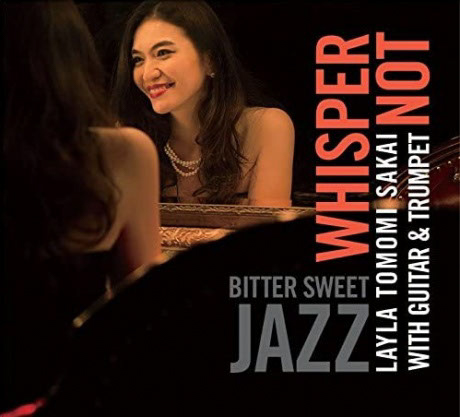 | 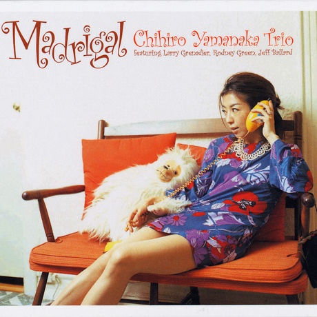
 | 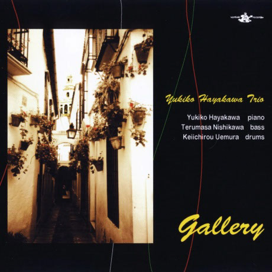 |  

---

## Audio Mix #7

<audio controls>
<source src="./audio/compilation-7.mp3" type="audio/mpeg">
Your browser does not support the audio element.
</audio>

1.  “Balkan Tale” - [Chihiro Yamanaka Trio: *Living Without Friday*](https://www.jazzofjapan.com/p/chihiro-yamanaka-trio-living-without-friday) - 00:00
2.  “Face” - [Ryosuke Hashizume Group: *Wordless*](https://www.jazzofjapan.com/p/ryosuke-hashizume-group-wordless) - 01:03
3.  “Confirmation” - [Emiko Voice x Suga Dairo: *Phase 2*](https://www.jazzofjapan.com/p/emiko-voice-x-suga-dairo-phase-2) - 02:06
4.  “Improvisation” - [Maiko: *Solo*](https://www.jazzofjapan.com/p/maiko-solo) - 03:09
5.  “Someday My Prince Will Come” - [Yukari Inoue: *Sakura*](https://www.jazzofjapan.com/p/yukari-inoue-sakura) - 04:14
6.  “Sora” - [Eriko Shimizu: *Sora*](https://www.jazzofjapan.com/p/eriko-shimizu-sora) - 05:17
7.  “Hisyo” - [Manabu Ohishi Trio: *Gift*](https://www.jazzofjapan.com/p/manabu-ohishi-trio-gift) - 06:20
8.  “Sakura” - [Yuko Miyawaki: *Song of Flower*](https://www.jazzofjapan.com/p/yuko-miyawaki-song-of-flower) - 07:23
9.  “Shibuya Crossing” - [Shunichi Yanagi Trio: *Bubble Fish*](https://www.jazzofjapan.com/p/shunichi-yanagi-trio-bubble-fish) - 08:27
10. “Over the Rainbow” - [Baby Brothers: *Bb*](https://www.jazzofjapan.com/p/baby-brothers-bb) - 09:30
11. “Underpass” - [Bungalow: *Metropolitan Oasis*](https://www.jazzofjapan.com/p/bungalow-metropolitan-oasis) - 10:43
12. “7up” - [Harumi Nomoto Trio: *Belinda*](https://www.jazzofjapan.com/p/harumi-nomoto-trio-belinda) - 12:01
13. “Pressentimento” - [Yuka Ueda: *Agora*](https://www.jazzofjapan.com/p/yuka-ueda-agora) - 13:14
14. “Metro Maniac” - [Motoi Kanamori: *My Soul Meeting*](https://www.jazzofjapan.com/p/motoi-kanamori-my-soul-meeting) - 14:22
15. “Fiesta” - [Arco: *Birth*](https://www.jazzofjapan.com/p/arco-birth) - 15:25
16. “Grasshopper” - [Fuse: *Live Fuse*](https://www.jazzofjapan.com/p/fuse-live-fuse) - 16:28
17. “Taxi” - [Chihiro Yamanaka Trio: *When October Goes*](https://www.jazzofjapan.com/p/chihiro-yamanaka-trio-when-october) - 17:34
18. “Major to Minor” - [Kohsuke Mine Quintet: *Major to Minor*](https://www.jazzofjapan.com/p/kohsuke-mine-quintet-major-to-minor) - 18:37

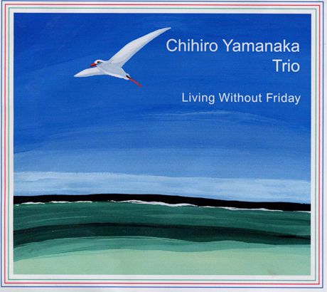 | 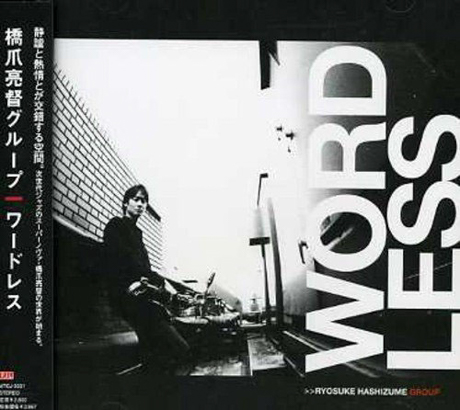 | 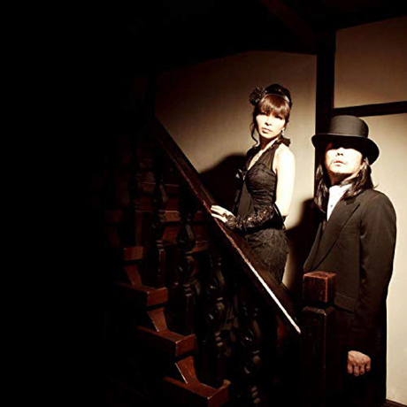
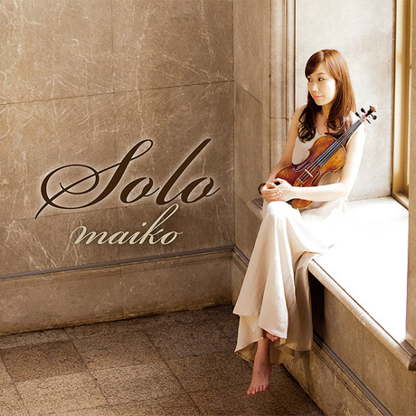 | 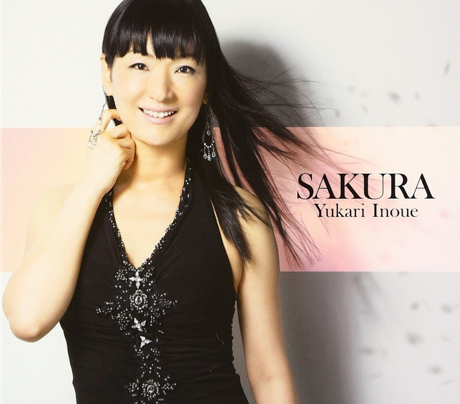 | 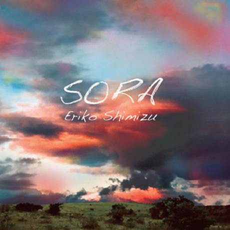
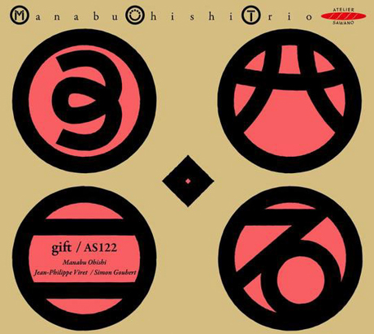 | 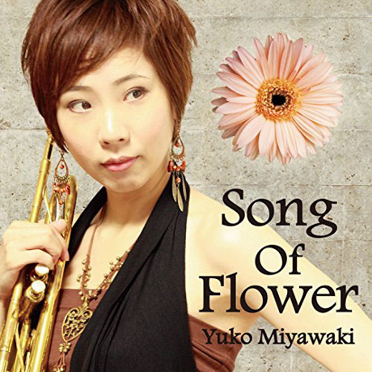 | 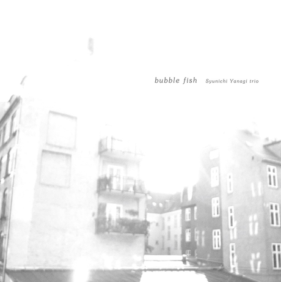
 | 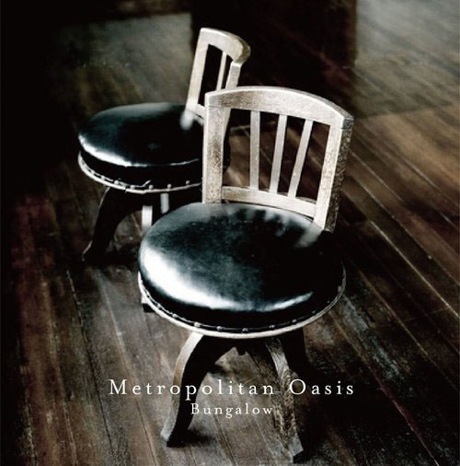 | 
 | 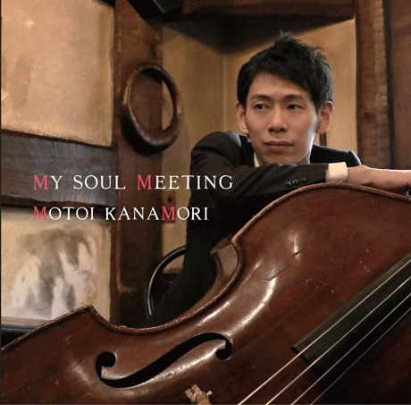 | 
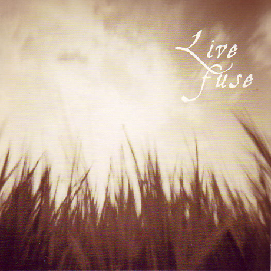 | 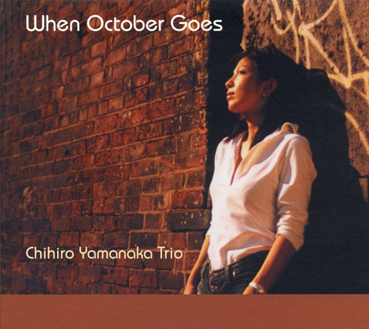 | 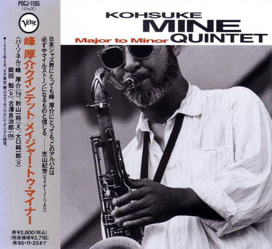

---

## Audio Mix #6

<audio controls>
<source src="./audio/compilation-6.mp3" type="audio/mpeg">
Your browser does not support the audio element.
</audio>

1.  “Beatrice” - [Miki Hayama: *Prelude to a Kiss*](https://www.jazzofjapan.com/p/miki-hayama-prelude-to-a-kiss) - 00:00
2.  “Workout” - [Seiji Tada: *Workout!!*](https://www.jazzofjapan.com/p/seiji-tada-workout) - 01:03
3.  “This is New” - [Hideaki Hori Trio: *In My Words*](https://www.jazzofjapan.com/p/hideaki-hori-trio-in-my-words) - 02:06
4.  “The Crosseyed Cat” - [Routine Jazz Sextet: *Routine Jazz Sextet*](https://www.jazzofjapan.com/p/routine-jazz-sextet-routine-jazz-sextet) - 03:09
5.  “Three” - [Maiko Trio: *Live! Three*](https://www.jazzofjapan.com/p/maiko-trio-live-three) - 04:12
6.  “Subliminal Sublimation” - [Rabbitoo: *National Anthem of Unknown Country*](https://www.jazzofjapan.com/p/rabbitoo-national-anthem-of-unknown) - 05:15
7.  “Mary Hartman, Mary Hartman” - [Hideaki Kanazawa & Sumire Kuribayashi: *Nijuso*](https://www.jazzofjapan.com/p/hideaki-kanazawa-sumire-kuribayashi-nijuso) - 06:18
8.  “Part 1 Acknowledgement” - [Noriko Satomi: *A Love Supreme*](https://www.jazzofjapan.com/p/noriko-satomi-a-love-supreme) - 07:21
9.  “Almost Like Being in Love” - [Azumi: *Almost Like Being in Love*](https://www.jazzofjapan.com/p/azumi-almost-like-being-in-love) - 08:24
10. “I Don’t Know Yet” - [Hiromi Miura: *We Don’t Know Yet*](https://www.jazzofjapan.com/p/hiromi-miura-we-dont-know-yet) - 09:28
11. “Wicked Wind” - [Yudo Matsuo: *Bonanza*](https://www.jazzofjapan.com/p/yudo-matsuo-bonanza) - 10:31
12. “Tonight” - [Daiki Yasukagawa Trio: *Trios II*](https://www.jazzofjapan.com/p/daiki-yasukagawa-trio-trios-ii) - 11:34
13. “Mr. PC” - [Fumio Karashima Trio: *It’s Just Beginning*](https://www.jazzofjapan.com/p/fumio-karashima-trio-its-just-beginning) - 12:37
14. “Ghosts Tear” - [Reikan Kobayashi: *Gakudan Hitori*](https://www.jazzofjapan.com/p/reikan-kobayashi-gakudan-hitori) - 13:40
15. “Tuck Box” - [Miyuki Moriya: *Cat’s Cradle*](https://www.jazzofjapan.com/p/miyuki-moriya-cats-cradle) - 14:43
16. “Part I” - [Trio Export 63.1.0.X: *Small Pieces for Flying Padre*](https://www.jazzofjapan.com/p/trio-export-small-pieces-for-flying-padre) - 15:46

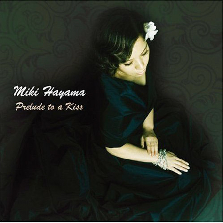 | 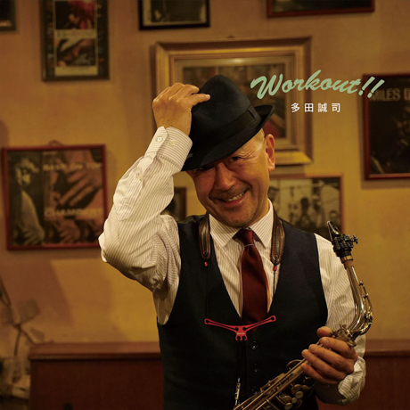 | 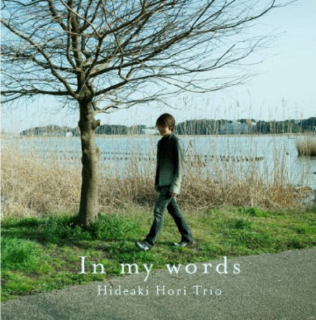
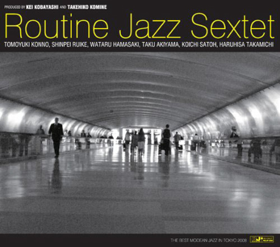 |  | 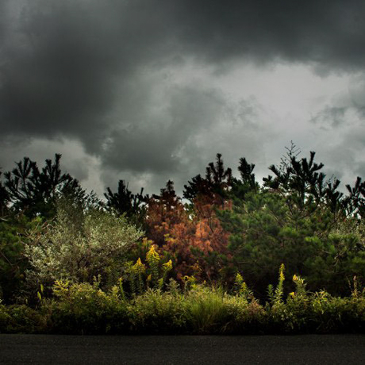
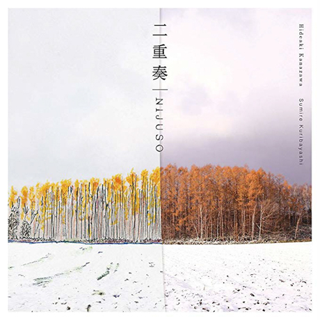 |  | 
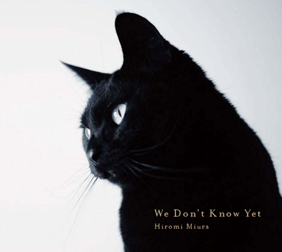 | 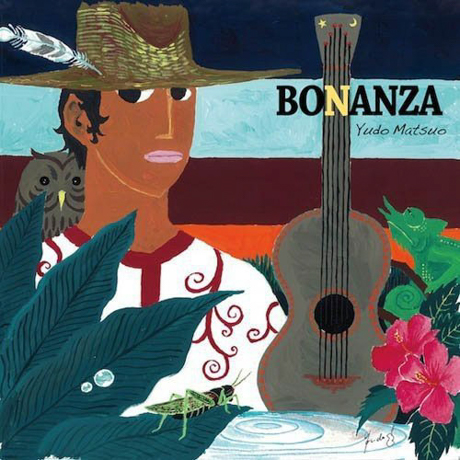 | 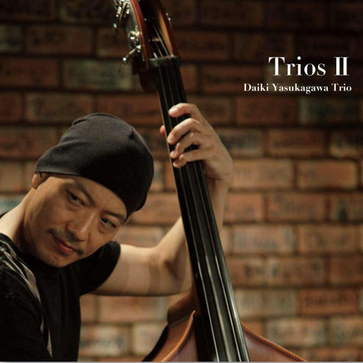
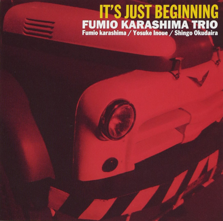 | 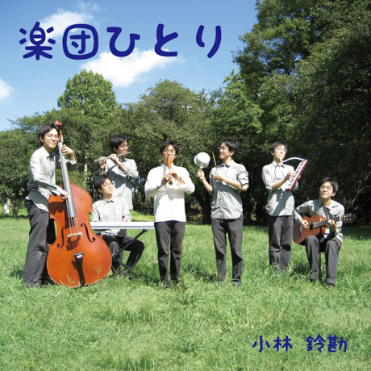 | 
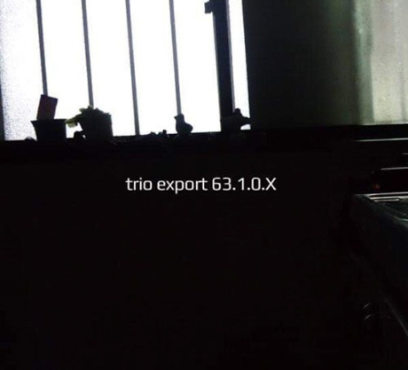 |   |  

---

## Audio Mix #5

<audio controls>
<source src="./audio/compilation-5.mp3" type="audio/mpeg">
Your browser does not support the audio element.
</audio>

1.  “Fairy Woods” - [Zephyr: *Zephyr*](https://www.jazzofjapan.com/p/zephyr-zephyr) - 00:00
2.  “Do Re Mi” - [Harumi Nomoto Trio: *Virgo*](https://www.jazzofjapan.com/p/harumi-nomoto-trio-virgo) - 01:03
3.  “I Loves You, Porgy” - [Yuichiro Aratake: *The Light Flows In*](https://www.jazzofjapan.com/p/yuichiro-aratake-light-flows-in) - 02:06
4.  “Yamikuro” - [Hikari Ichihara Group: *Move On*](https://www.jazzofjapan.com/p/hikari-ichihara-group-move-on) - 03:09
5.  “Sympathy” - [Hitomi Nishiyama Trio: *Sympathy*](https://www.jazzofjapan.com/p/hitomi-nishiyama-trio-sympathy) - 04:12
6.  “Kiritsubo” - [Seiji Endo: *Genji Monogatari Volume 1*](https://www.jazzofjapan.com/p/seiji-endo-genji-monogatari-volume-1) - 05:15
7.  “Only Trust Your Heart” - [Layla Tomomi Sakai: *The Island*](https://www.jazzofjapan.com/p/layla-tomomi-sakai-island) - 06:18
8.  “Karibu” - [Nobie: *Bénin Rio Tokyo*](https://www.jazzofjapan.com/p/nobie-benin-rio-tokyo) - 07:21
9.  “Long Ago and Far Away” - [Daiki Yasukagawa Trio: *Kanmai*](https://www.jazzofjapan.com/p/daiki-yasukagawa-trio-kanmai) - 08:24
10. “Don Papa” - [Sayaka Kishi Trio: *Life Is Too Great*](https://www.jazzofjapan.com/p/sayaka-kishi-trio-life-is-too-great) - 09:28
11. “Zi Zi” - [Minoru Yoshiki Soulstation: *Path of Hope*](https://www.jazzofjapan.com/p/minoru-yoshiki-soulstation-path-of-hope) - 10:31
12. “Cavatina” - [Shinichi Kato: *Bass on Cinema*](https://www.jazzofjapan.com/p/shinichi-kato-bass-on-cinema) - 11:34
13. “Cheek to Cheek” - [Mie Joké: *Etrenne*](https://www.jazzofjapan.com/p/mie-joke-etrenne) - 12:37
14. “Sequel to a Dream” - [Mabumi Yamaguchi: *Let Your Mind Alone*](https://www.jazzofjapan.com/p/mabumi-yamaguchi-let-your-mind-alone) - 13:40
15. “Under a Blanket of Blue” - [Yako Horikita: *Shining Hour*](https://www.jazzofjapan.com/p/yako-horikita-shining-hour) - 16:44
16. “Galaxies” - [NHORHM: *New Heritage of Real Heavy Metal -Extra Edition-*](https://www.jazzofjapan.com/p/nhorhm-extra-edition) - 17:47

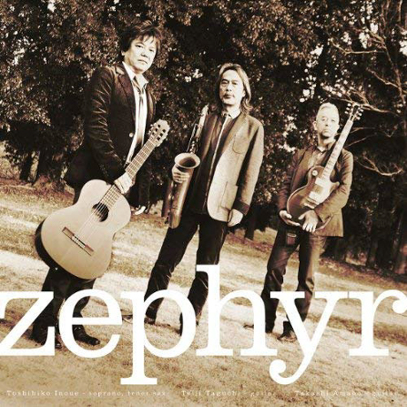 | 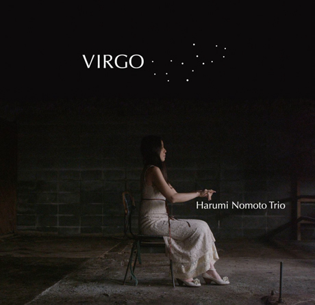 | 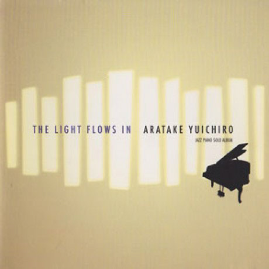
 | 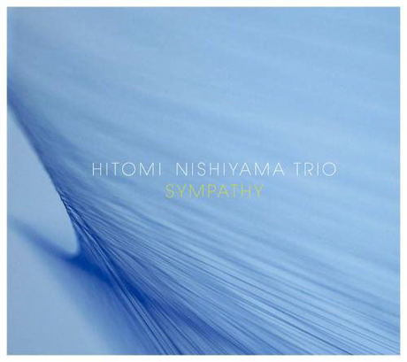 | 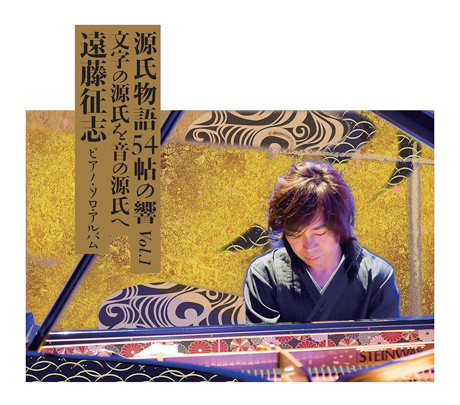
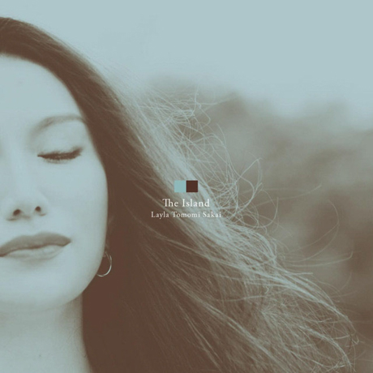 | 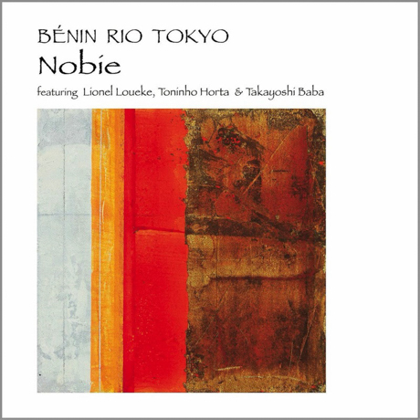 | 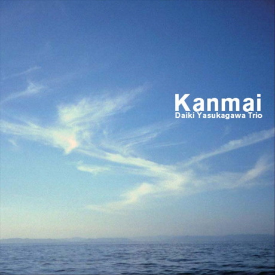
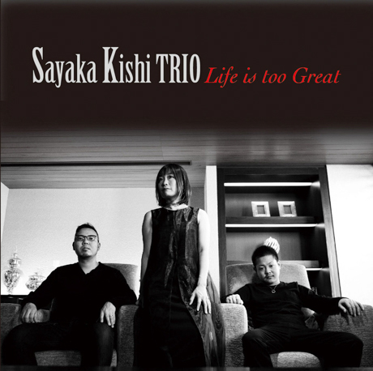 | 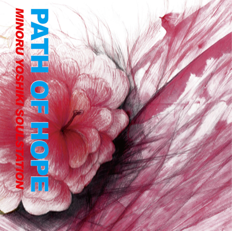 | 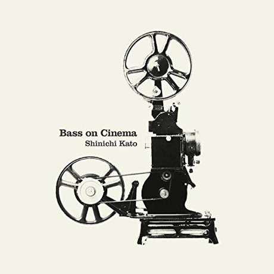
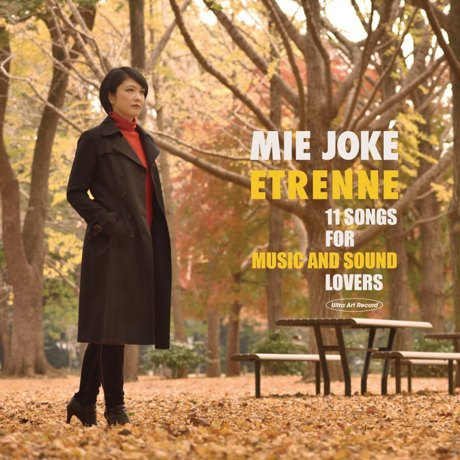 | 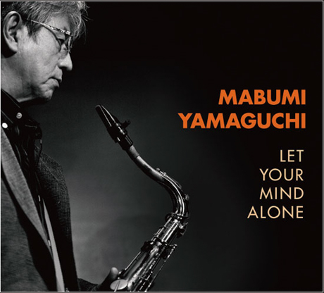 | 
 |   |  

---

## Audio Mix #4

<audio controls>
<source src="./audio/compilation-4.mp3" type="audio/mpeg">
Your browser does not support the audio element.
</audio>

1.  “I Need a Change, Too” - [Yasumasa Kumagai: *I Need a Change, Too*](https://www.jazzofjapan.com/p/yasumasa-kumagai-i-need-a-change-too) - 00:00
2.  “Offer Refused” - [Hakuei Kim Trio: *Open the Green Door*](https://www.jazzofjapan.com/p/hakuei-kim-trio-open-the-green-door) - 01:53
3.  “Absinthe” - [Ami Fukui: *Amizm*](https://www.jazzofjapan.com/p/ami-fukui-amizm) - 02:56
4.  “Mirrored Mirror” - [Koichi Sato: *Utopia*](https://www.jazzofjapan.com/p/koichi-sato-utopia) - 05:29
5.  “Dream Garden” - [Taihei Asakawa Trio: *Touch of Winter*](https://www.jazzofjapan.com/p/taihei-asakawa-trio-touch-of-winter) - 06:32
6.  “Bichigusorock” - [Sayaketts: *Colors*](https://www.jazzofjapan.com/p/sayaketts-colors) - 07:35
7.  “Sun Moon and Children Smile” - [Seiji Endo: *Sakura Meditation*](https://www.jazzofjapan.com/p/seiji-endo-sakura-meditation) - 08:38
8.  “Sally Gardens” - [Michiyo Matsushita: *Sally Gardens*](https://www.jazzofjapan.com/p/michiyo-matsushita-sally-gardens) - 11:30
9.  “Peaceful Mind” - [Trispace: *Trispace*](https://www.jazzofjapan.com/p/trispace-trispace) - 12:18
10. “11th Door” - [Fumie Chiba Trio: *Tip of Dream*](https://www.jazzofjapan.com/p/fumie-chiba-trio-tip-of-dream) - 13:21
11. “My Foolish Heart” - [Taihei Asakawa: *Waltz for Debby*](https://www.jazzofjapan.com/p/taihei-asakawa-waltz-for-debby) - 14:24
12. “Christmas Medley” - [Sanae Ishikawa: *Grown-up Christmas Gift*](https://www.jazzofjapan.com/p/sanae-ishikawa-grown-up-christmas) - 15:28
13. “Years” - [Tokuhiro Doi Quartet: *Amalthea*](https://www.jazzofjapan.com/p/tokuhiro-doi-quartet-amalthea) - 16:34
14. “Ray” - [Maki Fujimura: *Best Wishes*](https://www.jazzofjapan.com/p/maki-fujimura-best-wishes) - 17:37
15. “Cycles” - [Ryosuke Hashizume Group: *Visible/Invisible*](https://www.jazzofjapan.com/p/ryosuke-hashizume-group-visible-invisible) - 18:40
16. “The Nearness of You” - [Shinpei Ruike & George Nakajima: *N.40°*](https://www.jazzofjapan.com/p/shinpei-ruike-george-nakajima-n40) - 19:43
17. “Playing” - [Akane Matsumoto: *Playing New York*](https://www.jazzofjapan.com/p/akane-matsumoto-playing-new-york) - 20:46
18. “Sturm Und Drang” - [Blue Dot: *Halo*](https://www.jazzofjapan.com/p/blue-dot-halo) - 21:49
19. “From a Distance” - [Masako Kunisada: *M*](https://www.jazzofjapan.com/p/masako-kunisada-m) - 22:52

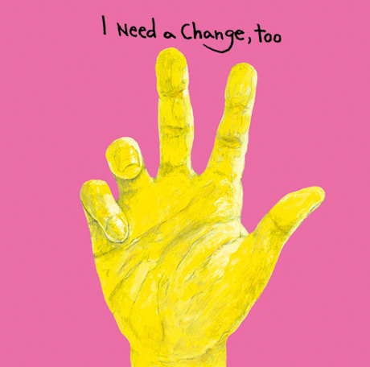 | 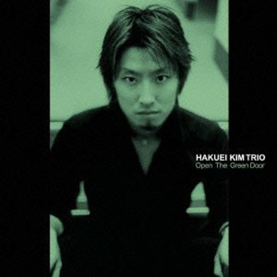 | 
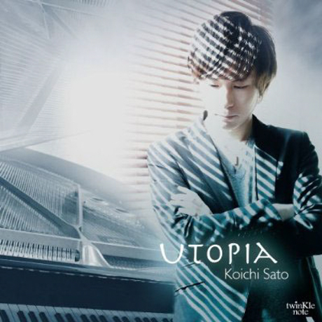 | 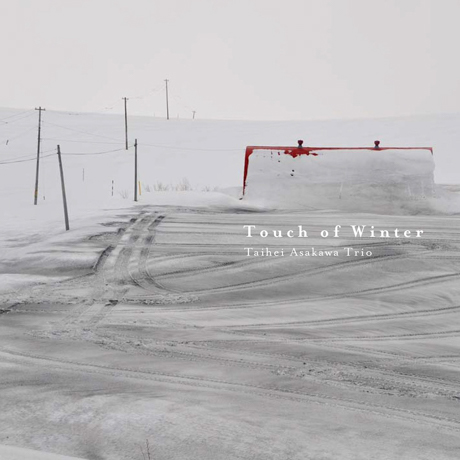 | 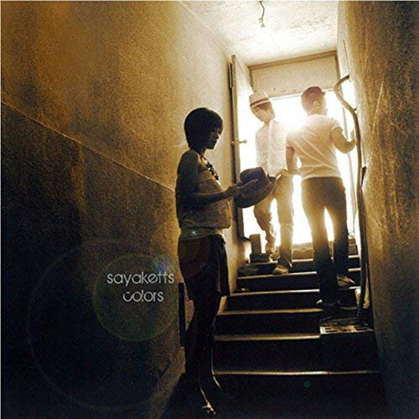
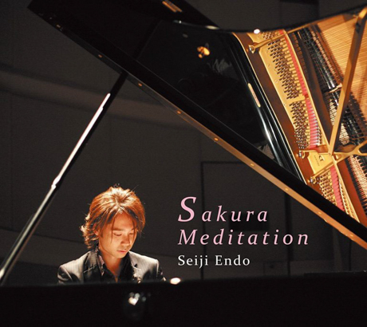 | 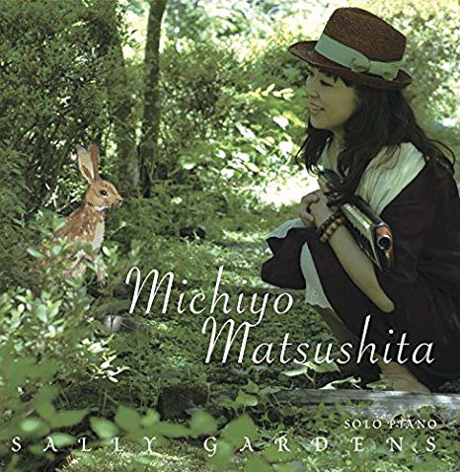 | 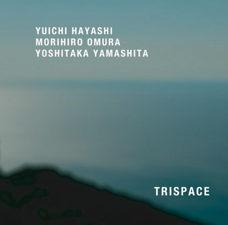
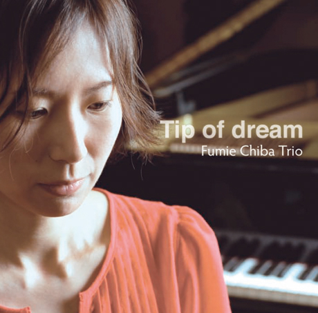 | 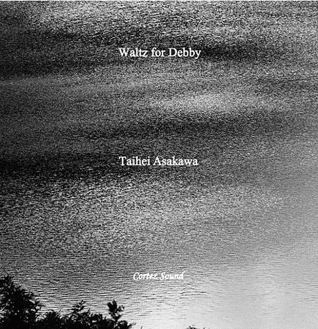 | 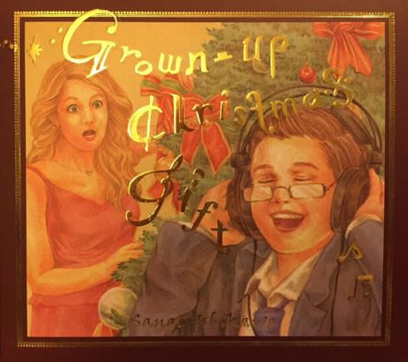
 |  | 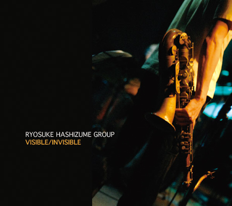
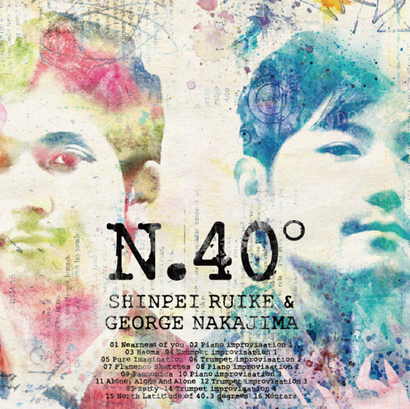 | 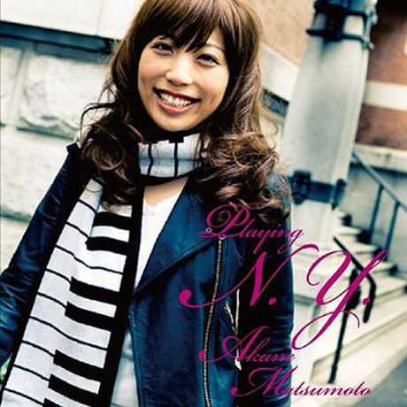 | 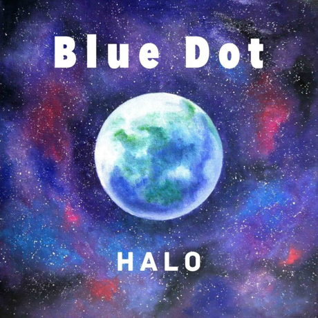
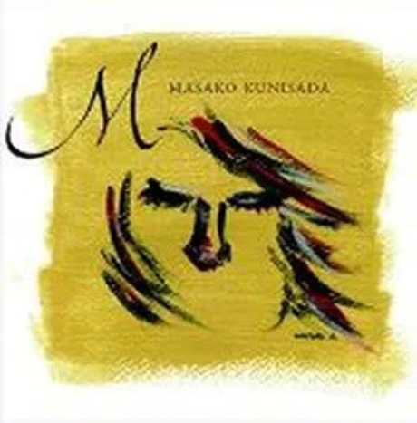 |   |  

---

## Audio Mix #3

<audio controls>
<source src="./audio/compilation-3.mp3" type="audio/mpeg">
Your browser does not support the audio element.
</audio>

1.  “Spur” - [Les Komatis: *Les Komatis*](https://www.jazzofjapan.com/p/les-komatis-les-komatis) - 00:00
2.  “A Dancer’s Melancholy” - [Mayuko Katakura: *The Echoes of Three*](https://www.jazzofjapan.com/p/mayuko-katakura-echoes-of-three) - 01:03
3.  “Move” - [Hitomi Nishiyama Trio “Parallax”: *Live*](https://www.jazzofjapan.com/p/hitomi-nishiyama-trio-parallax-live) - 02:06
4.  “I’m Yours” - [Manabu Ohishi Trio: *Wish*](https://www.jazzofjapan.com/p/manabu-ohishi-trio-wish) - 03:09
5.  “Four in One” - [Hara Dairiki Trio: *You’ve Changed*](https://www.jazzofjapan.com/p/hara-dairiki-trio-youve-changed) - 03:57
6.  “Two Lives” - [Ken’ichiro Shinzawa: *Piano Works*](https://www.jazzofjapan.com/p/kenichiro-shinzawa-piano-works) - 05:00
7.  “What’s Next” - [Miki Hayama Trio: *Wide Angle*](https://www.jazzofjapan.com/p/miki-hayama-trio-wide-angle) - 05:48
8.  “There Will Never Be Another You” - [Yuya Wakai: *Images*](https://www.jazzofjapan.com/p/yuya-wakai-images) - 06:51
9.  “With May” - [Ayumi Koketsu: *Rainbow Tales*](https://www.jazzofjapan.com/p/ayumi-koketsu-rainbow-tales) - 07:40
10. “Josho Kiryu” - [Bungalow: *Past Life*](https://www.jazzofjapan.com/p/bungalow-past-life) - 08:43
11. “Cheek to Cheek” - [Sanae Ishikawa: *Feel Like Makin’ Love*](https://www.jazzofjapan.com/p/sanae-ishikawa-feel-like-makin-love) - 09:31
12. “The Pioneer” - [Taihei Asakawa: *Catastrophe in Jazz*](https://www.jazzofjapan.com/p/taihei-asakawa-catastrophe-in-jazz) - 10:34
13. “Slow Highway” - [Ko Omura: *Introspect*](https://www.jazzofjapan.com/p/ko-omura-introspect) - 11:37
14. “Land Scape” - [Takako Yamada: *The Flow of Time*](https://www.jazzofjapan.com/p/takako-yamada-flow-of-time) - 12:40
15. “Over Parents” - [Yukako Yamano: *1st Stage*](https://www.jazzofjapan.com/p/yukako-yamano-1st-stage) - 13:43
16. “Big Catch” - [Wataru Hamasaki Meets Akane Matsumoto Trio: *Big Catch*](https://www.jazzofjapan.com/p/hamasaki-matsumoto-bigcatch) - 14:46
17. “Sabaku No Akari” - [Akihiro Yoshimoto Quartet: *Moving Color*](https://www.jazzofjapan.com/p/akihiro-yoshimoto-quartet-moving-color) - 15:49
18. “Our Love Is Here to Stay” - [Hideaki Hori Trio: *Unconditional Love*](https://www.jazzofjapan.com/p/hideaki-hori-trio-unconditional-love) - 18:24

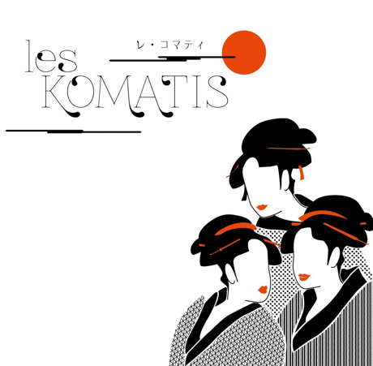 | 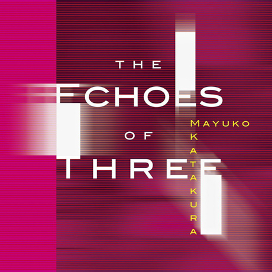 | 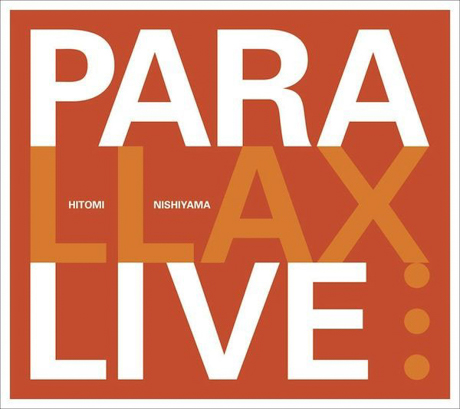
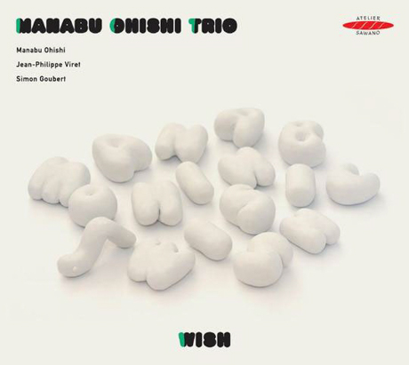 | 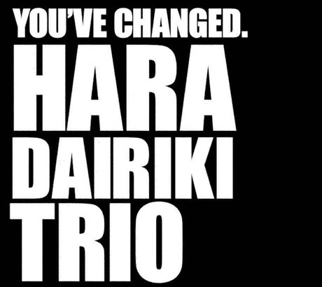 | 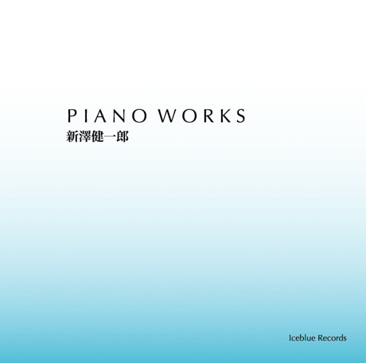
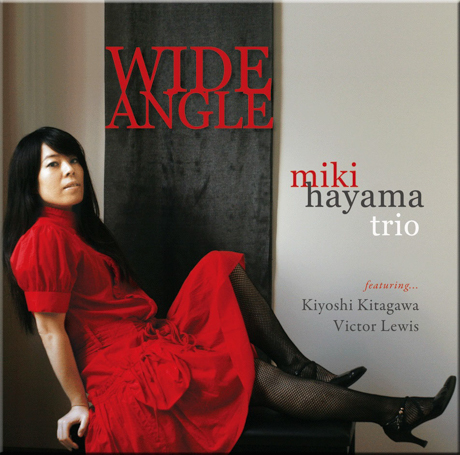 | 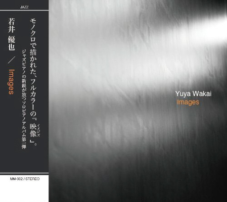 | 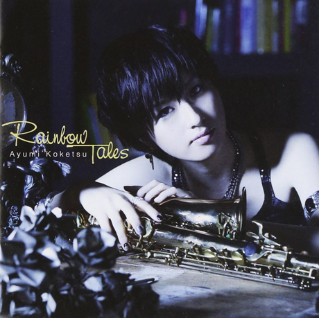
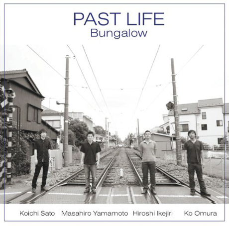 | 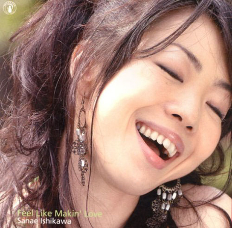 | 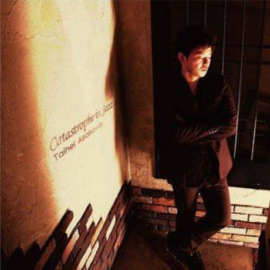
 | 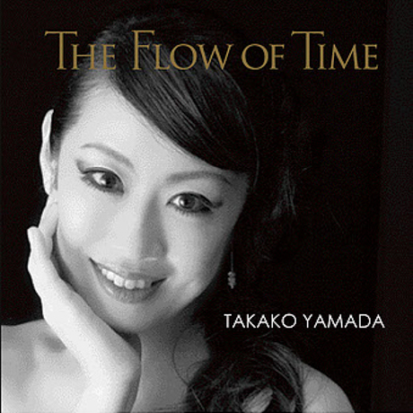 | 
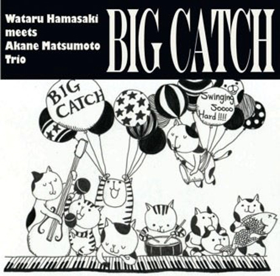 | 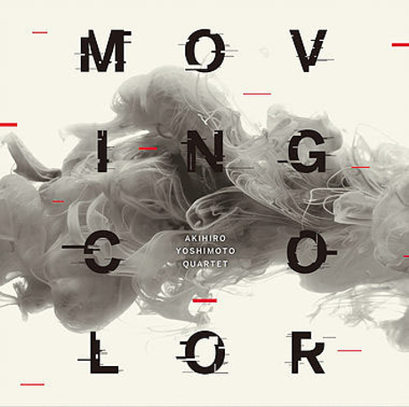 | 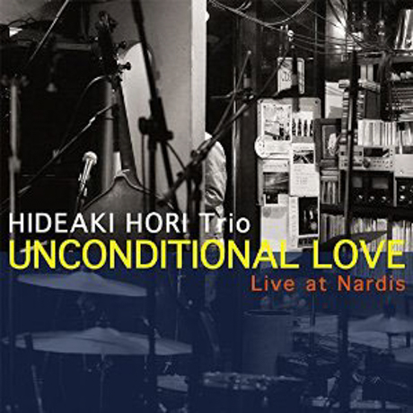

---

## Audio Mix #2

<audio controls>
<source src="./audio/compilation-2.mp3" type="audio/mpeg">
Your browser does not support the audio element.
</audio>

1.  “In a Reverse Way” - [Takuji Yamada: *Lite Blue*](https://www.jazzofjapan.com/p/takuji-yamada-lite-blue) - 00:00
2.  “Circle for Peace” - [Seiji Endo: *Circle for Peace*](https://www.jazzofjapan.com/p/seiji-endo-circle-for-peace) - 00:48
3.  “The Railway Station” - [Koichi Sato: *Melancholy of a Journey*](https://www.jazzofjapan.com/p/koichi-sato-melancholy) - 01:36
4.  “The Lady Is a Tramp” - [Rie Taguchi: *The Gift*](https://www.jazzofjapan.com/p/rie-taguchi-gift) - 02:24
5.  “Stone Pavement” - [Ryosuke Hashizume: *Needful Things*](https://www.jazzofjapan.com/p/ryosuke-hashizume-needful-things) - 03:12
6.  “Fireworks” - [Toshihiko Inoue: *Vayu*](https://www.jazzofjapan.com/p/toshihiko-inoue-vayu) - 04:15
7.  “Nag Champa” - [Sohnosuke Imaizumi: *Rin*](https://www.jazzofjapan.com/p/sohnosuke-imaizumi-rin) - 05:02
8.  “Blues for Tyner” - [Mayuko Katakura: *Inspiration*](https://www.jazzofjapan.com/p/mayuko-katakura-inspiration) - 05:50
9.  “Haru no Kaze” - [Sachiko Ikuta Trio: *Haru No Kaze*](https://www.jazzofjapan.com/p/sachiko-ikuta-trio-haru) - 06:38
10. “Ferris Wheel” - [Sumito Oi: *Sumitty & The Funfair*](https://www.jazzofjapan.com/p/sumito-oi-sumitty-and-the-funfair) - 07:27
11. “Love Dance” - [Tomoka Miwa: *Colors in Silence*](https://www.jazzofjapan.com/p/tomoka-miwa-colors) - 08:15
12. “Unfolding Universe” - [Hitomi Nishiyama Trio: *Music in You*](https://www.jazzofjapan.com/p/hitomi-nishiyama-trio-music-in-you) - 09:18
13. “Tsutaete Ikou” - [Seiji Endo: *Tsutaete Ikou*](https://www.jazzofjapan.com/p/seiji-endo-tsutaete-ikou) - 10:21
14. “Samba de Uma Nota So” - [Meu Coracao: *A Tempo*](https://www.jazzofjapan.com/p/meu-coracao-a-tempo) - 11:24
15. “New Journey” - [Ami Fukui Trio: *New Journey*](https://www.jazzofjapan.com/p/ami-fukui-trio-new-journey) - 12:12
16. “All the Things You Are” - [Atomi Hamada: *This is Atomi*](https://www.jazzofjapan.com/p/atomi-hamada-this-is-atomi) - 13:15
17. “Cross Point” - [Kaori Vibes Quartet: *Cross Point*](https://www.jazzofjapan.com/p/kaori-vibes-quartet-cross-point) - 14:18

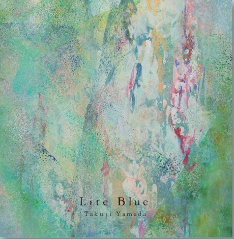 |  | 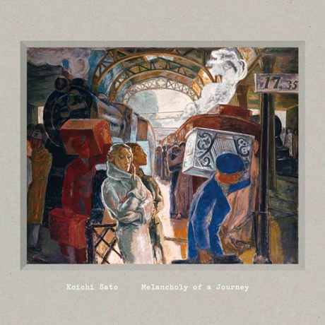
 | 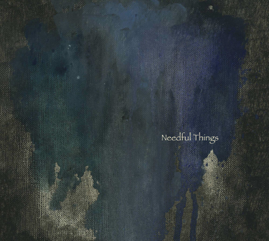 | 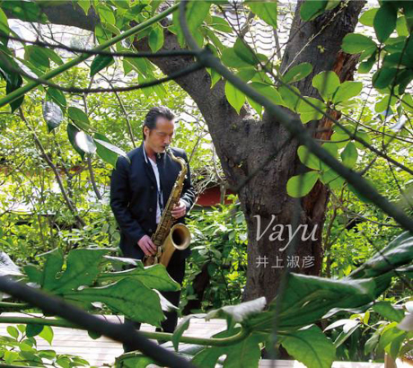
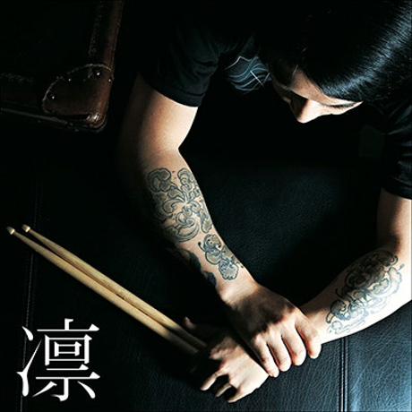 | 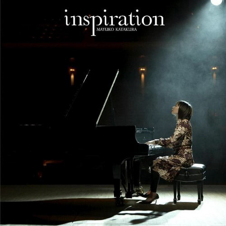 | 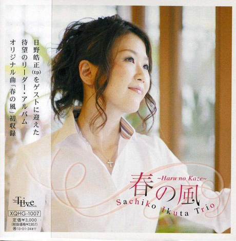
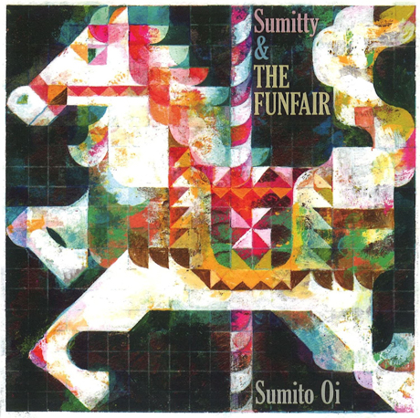 | 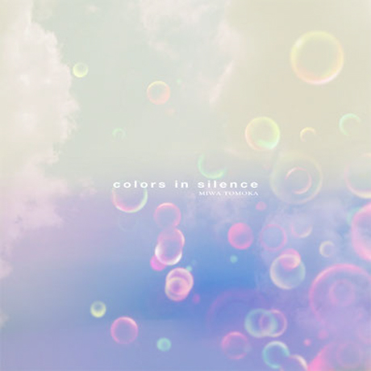 | 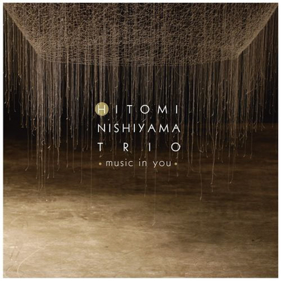
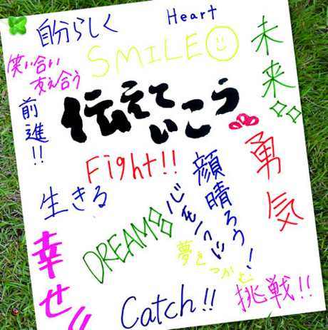 | 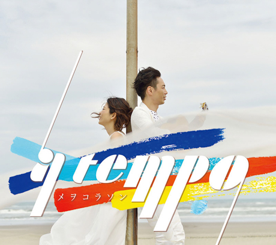 | 
 |  |  

---

## Audio Mix #1

<audio controls>
<source src="./audio/compilation-1.mp3" type="audio/mpeg">
Your browser does not support the audio element.
</audio>

1.  “Unspoken Language” - [Kazumi Ikenaga: *Niwatazumi*](https://www.jazzofjapan.com/p/kazumi-ikenaga-niwatazumi) - 00:00
2.  “Night and Day” - [Akane Matsumoto: *Night & Day*](https://www.jazzofjapan.com/p/akane-matsumoto-night-and-day) - 00:48
3.  “Cool Bunny” - [Ayumi Koketsu: *Art*](https://www.jazzofjapan.com/p/ayumi-koketsu-art) - 01:36
4.  “Santa Cruz” - [Bungalow: *You Already Know*](https://www.jazzofjapan.com/p/bungalow-you-already-know) - 02:24
5.  “The Days of Wine and Roses” - [Emiko Voice: *Carta*](https://www.jazzofjapan.com/p/emiko-voice-carta) - 03:12
6.  “Still” - [Ryosuke Hashizume Group: *Incomplete Voices*](https://www.jazzofjapan.com/p/ryosuke-hashizume-group-incomplete-voices) - 04:00
7.  “Draft Beer” - [Yasumasa Kumagai: *J-Straight Ahead*](https://www.jazzofjapan.com/p/yasumasa-kumagai-j-straight-ahead) - 04:48
8.  “Asymmetry” - [Arco: *Asymmetry*](https://www.jazzofjapan.com/p/arco-asymmetry) - 05:36
9.  “Up to You” - [Sayaka Kishi: *Featuring Te*](https://www.jazzofjapan.com/p/sayaka-kishi-featuring-te) - 06:24
10. “Flowers on the Hill” - [Akiko Suda: *Flowers On The Hill*](https://www.jazzofjapan.com/p/akiko-suda-flowers-on-the-hill) - 07:13
11. “Someone to Watch Over Me” - [Hiroco Nagano: *Okurimono*](https://www.jazzofjapan.com/p/hiroco-nagano-okurimono) - 08:01
12. “Flying Mind” - [Kaori Vibes Quartet: *Flying Mind*](https://www.jazzofjapan.com/p/kaori-vibes-quartet-flying-mind) - 08:49
13. “Monk’s Dream” - [Satoshi Kosugi: *Bass on Times*](https://www.jazzofjapan.com/p/satoshi-kosugi-bass-on-times) - 09:37
14. “Flood” - [Hitomi Nishiyama Trio: *Many Seasons*](https://www.jazzofjapan.com/p/hitomi-nishiyama-trio-many-seasons) - 10:25
15. “Speed Harassment” - [Keisuke Nakamura: *Humadope*](https://www.jazzofjapan.com/p/keisuke-nakamura-humadope) - 11:13
16. “Sopa de Ajo” - [Junichiro Ohkuchi Trio: *Invisible*](https://www.jazzofjapan.com/p/junichiro-ohkuchi-trio-invisible) - 12:01
17. “Mrs. Parker of KC” - [Mayuko Katakura: *Faith*](https://www.jazzofjapan.com/p/mayuko-katakura-faith) - 13:04

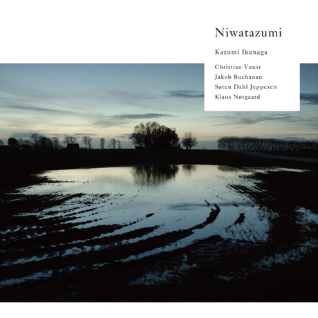 | 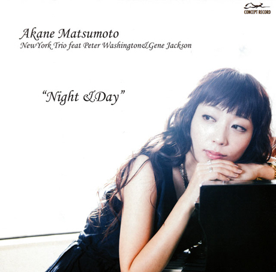 | 
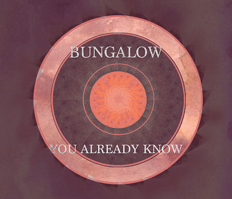 |  | 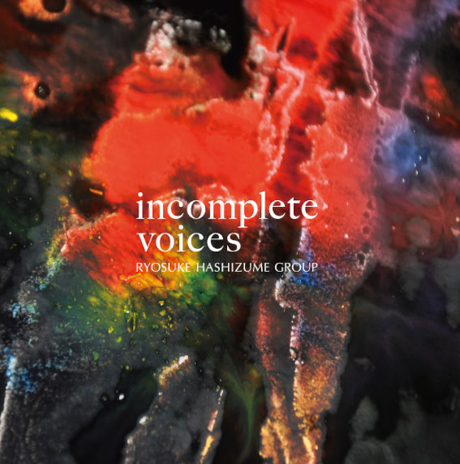
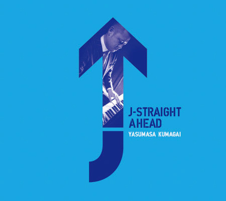 |  | 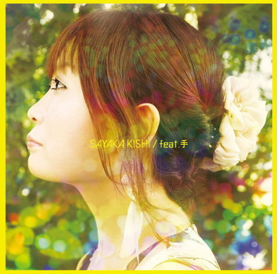
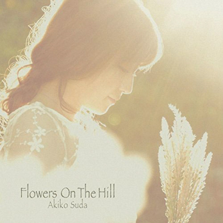 | 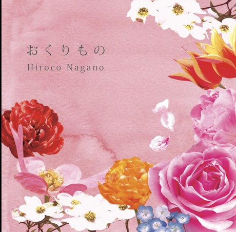 | 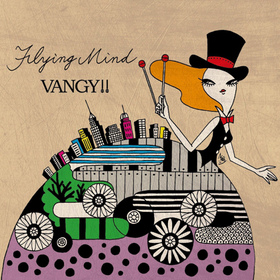
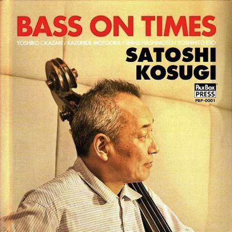 | 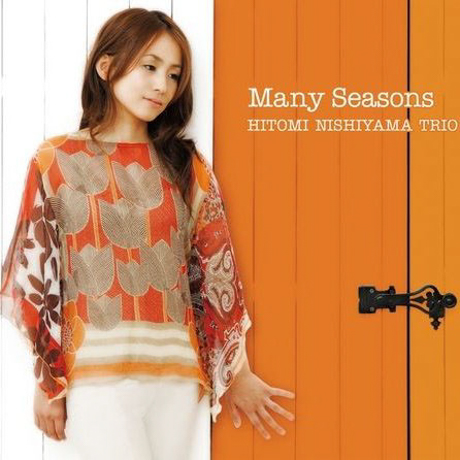 | 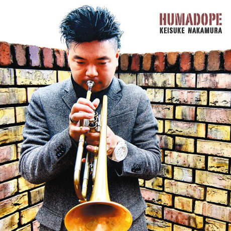
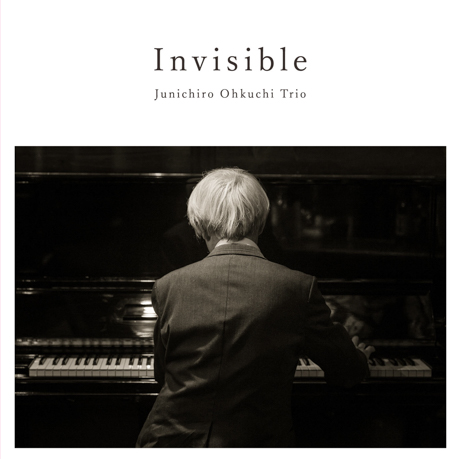 | 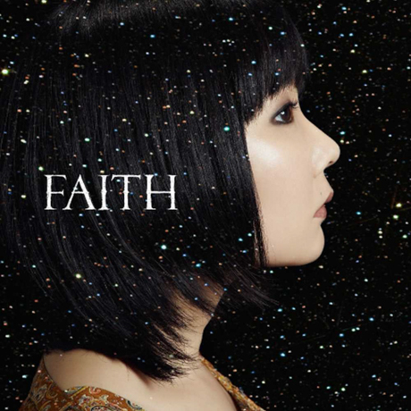 |  

