# Table of Contents

-   [Jazz of Japan](#org9106e7b)
-   [Albums by Category](#org4e65a6e)
    -   [1. Trumpet](#org751f456)
    -   [2. Saxophone](#org5ac2aaf)
    -   [3. Trombone](#orga5ccb79)
    -   [4. Flute](#org7229d69)
    -   [5. Clarinet](#org290a344)
    -   [6. Violin](#orgefe0f2a)
    -   [7. Cello](#orgcd6ec86)
    -   [8. Vibraphone](#orgb994c05)
    -   [9. Guitar](#org04ea31b)
    -   [10. Piano](#orgd85c18e)
    -   [11. Bass](#org66895dd)
    -   [12. Drums](#orgbc1ef39)
    -   [13. Vocals](#orgfb22b08)

# [Jazz of Japan](https://www.jazzofjapan.com/)

# Albums by Category

*Albums featured on this site are organized into categories based on the primary instrument or artist (primary or first listed) for each album. Each album appears once and in one category only.*

## 1. Trumpet

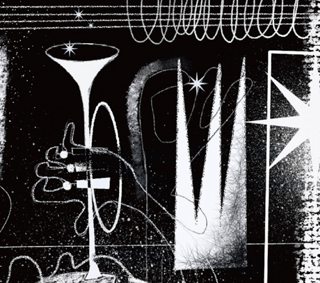 | 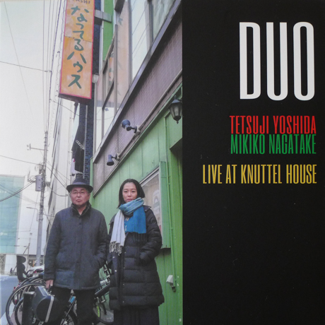 | 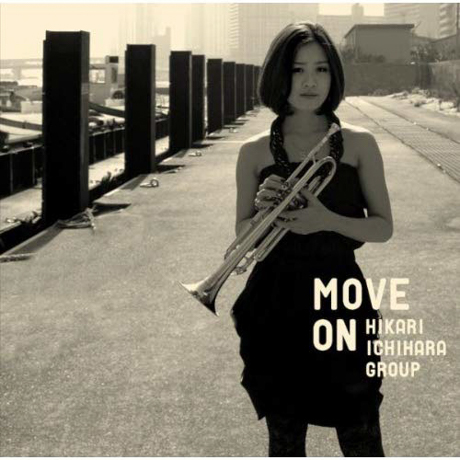

-   *[Duo](https://www.jazzofjapan.com/p/shinpei-ruike-george-nakajima-duo)* by Shinpei Ruike & George Nakajima
-   *[Humadope](https://www.jazzofjapan.com/p/keisuke-nakamura-humadope)* by Keisuke Nakamura
-   *[Humadope 2](https://www.jazzofjapan.com/p/keisuke-nakamura-humadope-2)* by Keisuke Nakamura
-   *[Live at Knuttel House](https://www.jazzofjapan.com/p/tetsuji-yoshida-and-mikiko-nagatake)* by Tetsuji Yoshida & Mikiko Nagatake Duo
-   *[Move On](https://www.jazzofjapan.com/p/hikari-ichihara-group-move-on)* by Hikari Ichihara Group
-   *[N.40°](https://www.jazzofjapan.com/p/shinpei-ruike-george-nakajima-n40)* by Shinpei Ruike & George Nakajima
-   *[Sara Smile](https://www.jazzofjapan.com/p/hikari-ichihara-sara-smile)* by Hikari Ichihara
-   *[Scratch](https://www.jazzofjapan.com/p/miki-hirose-scratch)* by Miki Hirose
-   *[Song of Flower](https://www.jazzofjapan.com/p/yuko-miyawaki-song-of-flower)* by Yuko Miyawaki
-   *[Unity](https://www.jazzofjapan.com/p/hikari-ichihara-group-unity)* by Hikari Ichihara Group \*
-   *See all: [#trumpet](https://www.jazzofjapan.com/t/trumpet)*

## 2. Saxophone

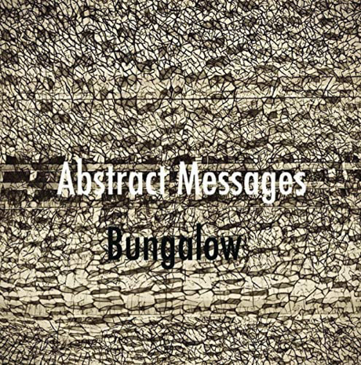 |  | 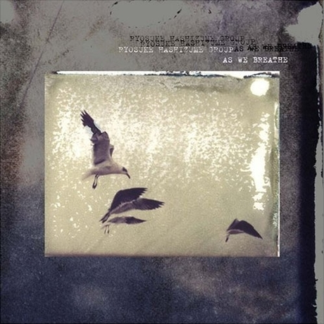

-   *[64 Charlesgate](https://www.jazzofjapan.com/p/akihiro-yoshimoto-quartet-64-charlesgate)* by Akihiro Yoshimoto Quartet
-   *[Abstract Messages](https://www.jazzofjapan.com/p/bungalow-abstract-messages)* by Bungalow
-   *[Acoustic Fluid](https://www.jazzofjapan.com/p/ryosuke-hashizume-group-acoustic)* by Ryosuke Hashizume Group
-   *[Art](https://www.jazzofjapan.com/p/ayumi-koketsu-art)* by Ayumi Koketsu
-   *[As We Breathe](https://www.jazzofjapan.com/p/ryosuke-hashizume-group-as-we-breathe)* by Ryosuke Hashizume Group \*
-   *[Beyond the Sea](https://www.jazzofjapan.com/p/miyuki-moriya-beyond-the-sea)* by Miyuki Moriya
-   *[Big Catch](https://www.jazzofjapan.com/p/hamasaki-matsumoto-bigcatch)* by Wataru Hamasaki Meets Akane Matsumoto Trio
-   *[Cat’s Cradle](https://www.jazzofjapan.com/p/miyuki-moriya-cats-cradle)* by Miyuki Moriya
-   *[Encounter](https://www.jazzofjapan.com/p/hideaki-hori-wataru-hamasaki-encounter)* by Hideaki Hori & Wataru Hamasaki
-   *[First Contact](https://www.jazzofjapan.com/p/mase-hiroko-quintet-first-contact)* by Mase Hiroko Quintet
-   *[Incomplete Voices](https://www.jazzofjapan.com/p/ryosuke-hashizume-group-incomplete-voices)* by Ryosuke Hashizume Group
-   *[Jabuticaba](https://www.jazzofjapan.com/p/jabuticaba-jabuticaba)* by Jabuticaba
-   *[Let Your Mind Alone](https://www.jazzofjapan.com/p/mabumi-yamaguchi-let-your-mind-alone)* by Mabumi Yamaguchi
-   *[Lite Blue](https://www.jazzofjapan.com/p/takuji-yamada-lite-blue)* by Takuji Yamada
-   *[Live Fuse](https://www.jazzofjapan.com/p/fuse-live-fuse)* by Fuse
-   *[Longing](https://www.jazzofjapan.com/p/yosuke-sato-george-nakajima-longing)* by Yosuke Sato & George Nakajima
-   *[Major to Minor](https://www.jazzofjapan.com/p/kohsuke-mine-quintet-major-to-minor)* by Kohsuke Mine Quintet
-   *[Mawsim](https://www.jazzofjapan.com/p/nami-kano-mawsim)* by Nami Kano
-   *[Memories of T](https://www.jazzofjapan.com/p/tcq-memories-of-t)* by TCQ
-   *[Metropolitan Oasis](https://www.jazzofjapan.com/p/bungalow-metropolitan-oasis)* by Bungalow
-   *[Mistral](https://www.jazzofjapan.com/p/toshihiko-inoue-and-masaki-hayashi)* by Toshihiko Inoue & Masaki Hayashi
-   *[Moving Color](https://www.jazzofjapan.com/p/akihiro-yoshimoto-quartet-moving-color)* by Akihiro Yoshimoto Quartet
-   *[Needful Things](https://www.jazzofjapan.com/p/ryosuke-hashizume-needful-things)* by Ryosuke Hashizume
-   *[Oxymoron](https://www.jazzofjapan.com/p/akihiro-yoshimoto-takashi-sugawa-oxymoron)* by Akihiro Yoshimoto & Takashi Sugawa *(free/experimental)*
-   *[Past Life](https://www.jazzofjapan.com/p/bungalow-past-life)* by Bungalow
-   *[Rainbow Tales](https://www.jazzofjapan.com/p/ayumi-koketsu-rainbow-tales)* by Ayumi Koketsu
-   *[Side Two](https://www.jazzofjapan.com/p/ryosuke-hashizume-group-side-two)* by Ryosuke Hashizume Group
-   *[Skipping Down the Street](https://www.jazzofjapan.com/p/seiji-harakawa-quartet-skipping-down)* by Seiji Harakawa Quartet
-   *[Trust](https://www.jazzofjapan.com/p/akane-matsumoto-ayumi-koketsu-trust)* by Akane Matsumoto & Ayumi Koketsu
-   *[Un Jour](https://www.jazzofjapan.com/p/clepsydra-un-jour)* by Clepsydra
-   *[Unseen Scenes](https://www.jazzofjapan.com/p/bungalow-unseen-scenes)* by Bungalow
-   *[Uta Oto](https://www.jazzofjapan.com/p/miyuki-moriya-uta-oto)* by Miyuki Moriya
-   *[Vayu](https://www.jazzofjapan.com/p/toshihiko-inoue-vayu)* by Toshihiko Inoue *(solo)*
-   *[Viento](https://www.jazzofjapan.com/p/mabumi-yamaguchi-viento)* by Mabumi Yamaguchi
-   *[VisibleInvisible](https://www.jazzofjapan.com/p/ryosuke-hashizume-group-visible-invisible)* by Ryosuke Hashizume Group
-   *[We Don’t Know Yet](https://www.jazzofjapan.com/p/hiromi-miura-we-dont-know-yet)* by Hiromi Miura
-   *[Wordless](https://www.jazzofjapan.com/p/ryosuke-hashizume-group-wordless)* by Ryosuke Hashizume Group
-   *[Workout!!](https://www.jazzofjapan.com/p/seiji-tada-workout)* by Seiji Tada
-   *[You Already Know](https://www.jazzofjapan.com/p/bungalow-you-already-know)* by Bungalow
-   *[Zephyr](https://www.jazzofjapan.com/p/zephyr-zephyr)* by Zephyr
-   *See all: [#saxophone](https://www.jazzofjapan.com/t/saxophone)*

## 3. Trombone

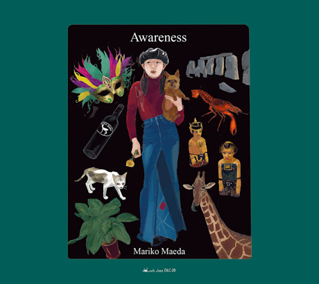 | 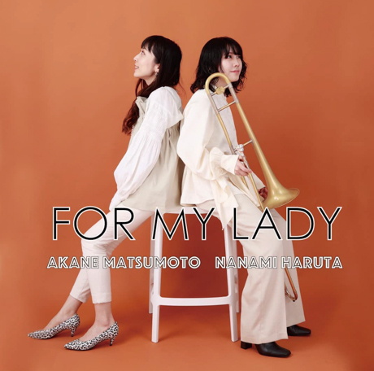 | 

-   *[Awareness](https://www.jazzofjapan.com/p/mariko-maeda-awareness)* by Mariko Maeda
-   *[For My Lady](https://www.jazzofjapan.com/p/akane-matsumoto-nanami-haruta-for)* by Akane Matsumoto & Nanami Haruta
-   *[II](https://www.jazzofjapan.com/p/nanami-haruta-ii)* by Nanami Haruta \*
-   *See all: [#trombone](https://www.jazzofjapan.com/t/trombone)*

## 4. Flute

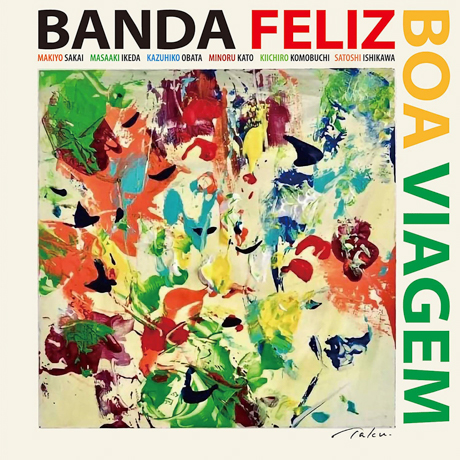 | 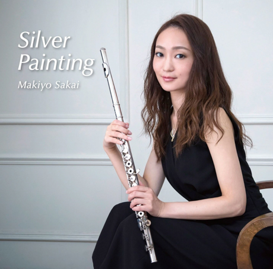 | 

-   *[Boa Viagem](https://www.jazzofjapan.com/p/banda-feliz-boa-viagem)* by Banda Feliz *(Brazilian/Latin jazz)*
-   *[Gakudan Hitori](https://www.jazzofjapan.com/p/reikan-kobayashi-gakudan-hitori)* by Reikan Kobayashi
-   *[Silver Painting](https://www.jazzofjapan.com/p/makiyo-sakai-silver-painting)* by Makiyo Sakai \*
-   *[Where Have U Been?](https://www.jazzofjapan.com/p/erisa-ogawa-where-have-u-been)* by Erisa Ogawa
-   *See all: [#flute](https://www.jazzofjapan.com/t/flute)*

## 5. Clarinet

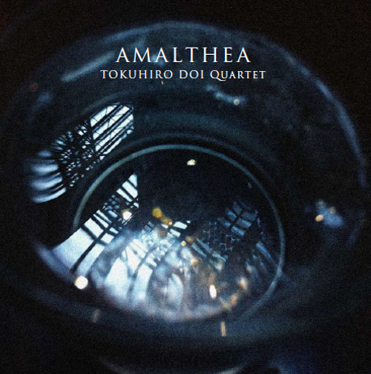

-   *[Amalthea](https://www.jazzofjapan.com/p/tokuhiro-doi-quartet-amalthea)* by Tokuhiro Doi Quartet \*
-   *See all: [#clarinet](https://www.jazzofjapan.com/t/clarinet)*

## 6. Violin

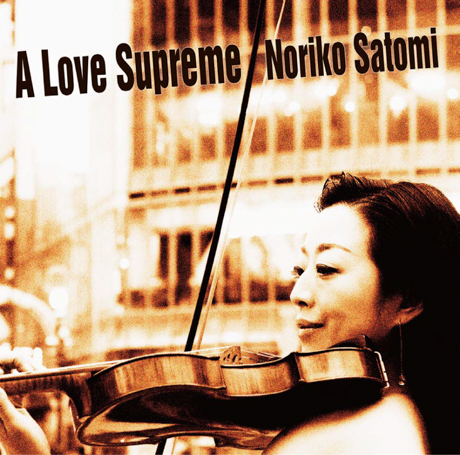 | 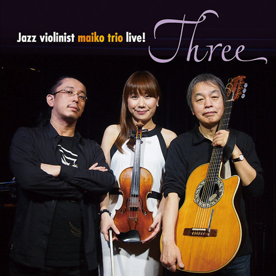 | 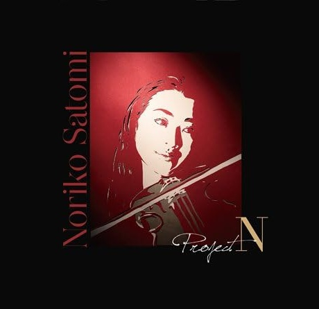

-   *[A Love Supreme](https://www.jazzofjapan.com/p/noriko-satomi-a-love-supreme)* by Noriko Satomi
-   *[Live! Three](https://www.jazzofjapan.com/p/maiko-trio-live-three)* by Maiko Trio
-   *[Project-N](https://www.jazzofjapan.com/p/noriko-satomi-project-n)* by Noriko Satomi \*
-   *[Solo](https://www.jazzofjapan.com/p/maiko-solo)* by Maiko *(solo)*
-   *See all: [#violin](https://www.jazzofjapan.com/t/violin)*

## 7. Cello

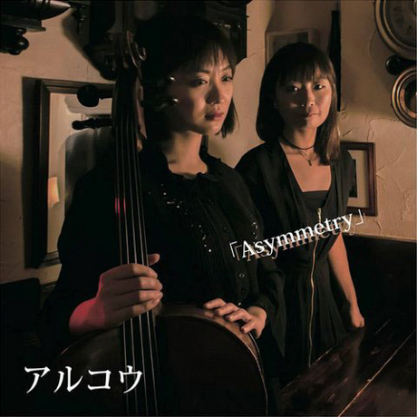 | 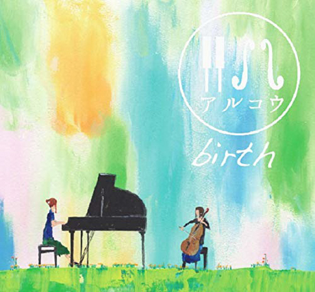 | 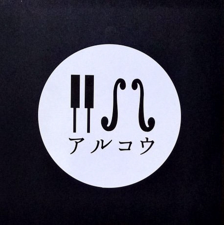

-   *[Asymmetry](https://www.jazzofjapan.com/p/arco-asymmetry)* by Arco
-   *[Birth](https://www.jazzofjapan.com/p/arco-birth)* by Arco
-   *[Live At Yoncha](https://www.jazzofjapan.com/p/arco-live-at-yoncha)* by Arco \*
-   *See all: [#cello](https://www.jazzofjapan.com/t/cello)*

## 8. Vibraphone

 | 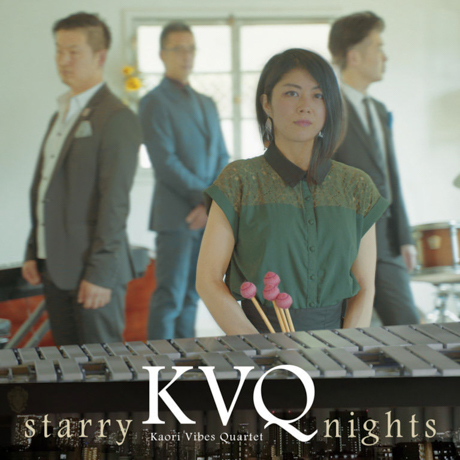 | 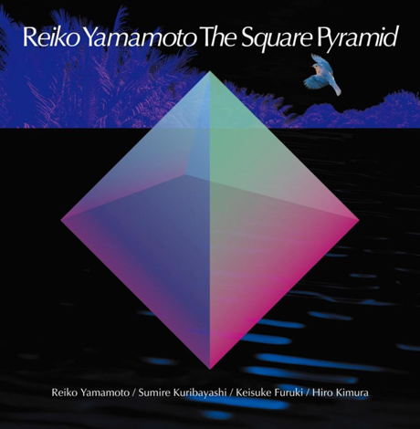

-   *[Cross Point](https://www.jazzofjapan.com/p/kaori-vibes-quartet-cross-point)* by Kaori Vibes Quartet
-   *[El viento y las flores](https://www.jazzofjapan.com/p/magnolia-el-viento-y-las-flores)* by Magnolia \*
-   *[Flying Mind](https://www.jazzofjapan.com/p/kaori-vibes-quartet-flying-mind)* by Kaori Vibes Quartet
-   *[Here Goes!](https://www.jazzofjapan.com/p/fumiko-yamazaki-here-goes)* by Fumiko Yamazaki
-   *[Starry Nights](https://www.jazzofjapan.com/p/kaori-vibes-quartet-starry-nights)* by Kaori Vibes Quartet
-   *[The Square Pyramid](https://www.jazzofjapan.com/p/reiko-yamamoto-square-pyramid)* by Reiko Yamamoto
-   *See all: [#vibraphone](https://www.jazzofjapan.com/t/vibraphone)*

## 9. Guitar

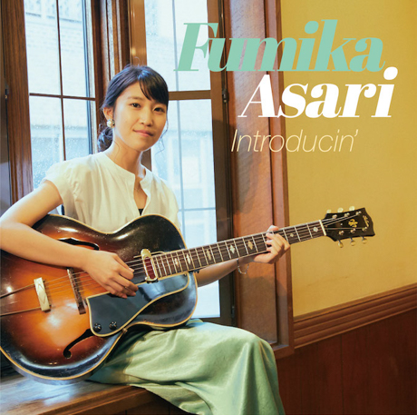 | 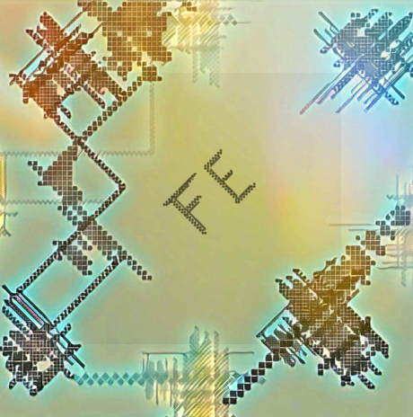 | 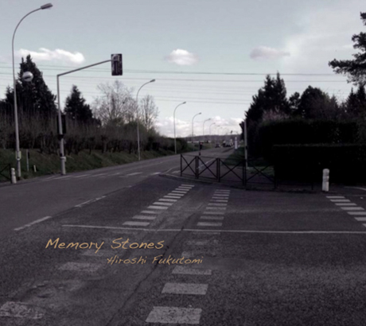

-   *[Bonanza](https://www.jazzofjapan.com/p/yudo-matsuo-bonanza)* by Yudo Matsuo
-   *[Childhood’s Dream](https://www.jazzofjapan.com/p/shigeo-fukuda-and-toshiki-nunokawa)* by Shigeo Fukuda & Toshiki Nunokawa
-   *[Frozen Dust](https://www.jazzofjapan.com/p/takumi-seino-motohiko-ichino-frozen-dust)* by Takumi Seino & Motohiko Ichino *(free/experimental)*
-   *[Introducin’](https://www.jazzofjapan.com/p/fumika-asari-introducin)* by Fumika Asari
-   *[Live at Virtuoso](https://www.jazzofjapan.com/p/fe-live-at-virtuoso)* by Fe
-   *[Melodies](https://www.jazzofjapan.com/p/melodies-melodies)* by Melodies *(free/experimental)*
-   *[Memory Stones](https://www.jazzofjapan.com/p/hiroshi-fukutomi-memory-stones)* by Hiroshi Fukutomi
-   *[National Anthem of Unknown Country](https://www.jazzofjapan.com/p/rabbitoo-national-anthem-of-unknown)* by Rabbitoo
-   *[Resonance](https://www.jazzofjapan.com/p/duo-tremolo-resonance)* by Duo Tremolo
-   *[Sketches](https://www.jazzofjapan.com/p/motohiko-ichino-sketches)* by Motohiko Ichino
-   *[The Goat on a Peak](https://www.jazzofjapan.com/p/ghost-peak-goat-on-a-peak)* by Ghost Peak *(free/experimental)*
-   *[The Torch](https://www.jazzofjapan.com/p/rabbitoo-the-torch)* by Rabbitoo
-   *[Two for the Road](https://www.jazzofjapan.com/p/yuji-ito-koichi-hirata-duo-two-for-the-road)* by Yuji Ito & Koichi Hirata Duo \*
-   *See all: [#guitar](https://www.jazzofjapan.com/t/guitar)*

## 10. Piano

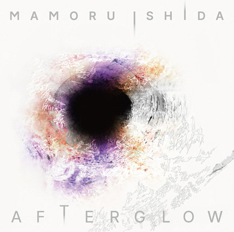 | 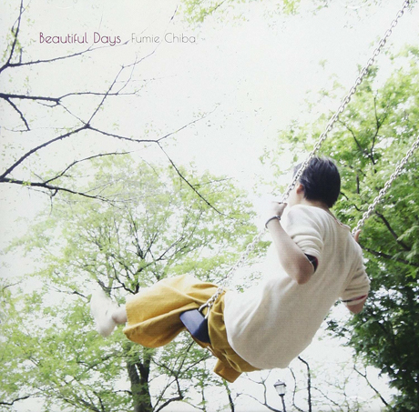 | 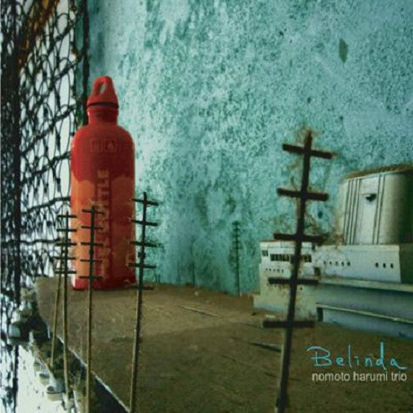

-   *[1st Stage](https://www.jazzofjapan.com/p/yukako-yamano-1st-stage)* by Yukako Yamano
-   *[3rd Stage](https://www.jazzofjapan.com/p/yukako-yamano-3rd-stage)* by Yukako Yamano *(solo)*
-   *[Abyss](https://www.jazzofjapan.com/p/chihiro-yamanaka-abyss)* by Chihiro Yamanaka
-   *[Afterglow](https://www.jazzofjapan.com/p/mamoru-ishida-afterglow)* by Mamoru Ishida
-   *[Amizm](https://www.jazzofjapan.com/p/ami-fukui-amizm)* by Ami Fukui
-   *[Another Ordinary Day](https://www.jazzofjapan.com/p/harumi-nomoto-trio-another-ordinary-day)* by Harumi Nomoto Trio
-   *[Appreciation](https://www.jazzofjapan.com/p/naoko-tanaka-appreciation)* by Naoko Tanaka
-   *[Aquapit](https://www.jazzofjapan.com/p/aquapit-aquapit)* by Aquapit *(Hammond B3 organ)*
-   *[Banquet](https://www.jazzofjapan.com/p/sayaka-kishi-trio-banquet)* by Sayaka Kishi Trio
-   *[Beautiful Days](https://www.jazzofjapan.com/p/fumie-chiba-beautiful-days)* by Fumie Chiba
-   *[Belinda](https://www.jazzofjapan.com/p/harumi-nomoto-trio-belinda)* by Harumi Nomoto Trio
-   *[Beloved Ones](https://www.jazzofjapan.com/p/yuka-yanagihara-trio-beloved-ones)* by Yuka Yanagihara Trio
-   *[Boundary](https://www.jazzofjapan.com/p/megumi-yonezawa-masa-kamaguchi-ken-kobayashi-boundary)* by Megumi Yonezawa / Masa Kamaguchi / Ken Kobayashi *(free/experimental)*
-   *[Bubble Fish](https://www.jazzofjapan.com/p/shunichi-yanagi-trio-bubble-fish)* by Shunichi Yanagi Trio
-   *[Calling](https://www.jazzofjapan.com/p/hitomi-nishiyama-trio-calling)* by Hitomi Nishiyama Trio
-   *[Canvas](https://www.jazzofjapan.com/p/fnk-canvas)* by FNK
-   *[Catastrophe in Jazz](https://www.jazzofjapan.com/p/taihei-asakawa-catastrophe-in-jazz)* by Taihei Asakawa
-   *[Circle for Peace](https://www.jazzofjapan.com/p/seiji-endo-circle-for-peace)* by Seiji Endo *(solo)*
-   *[Colors](https://www.jazzofjapan.com/p/sayaketts-colors)* by Sayaketts
-   *[Crossing Reality](https://www.jazzofjapan.com/p/eri-chichibu-crossing-reality)* by Eri Chichibu
-   *[Dot](https://www.jazzofjapan.com/p/hitomi-nishiyama-dot)* by Hitomi Nishiyama
-   *[Dubai Suite](https://www.jazzofjapan.com/p/yukakoyamano-yukariinoue-dubai)* by Yukako Yamano & Yukari Inoue *(piano duo)*
-   *[Duo](https://www.jazzofjapan.com/p/taeko-kurita-akira-sotoyama-duo)* by Taeko Kurita & Akira Sotoyama
-   *[Echo](https://www.jazzofjapan.com/p/hitomi-nishiyama-echo)* by Hitomi Nishiyama
-   *[Embryo](https://www.jazzofjapan.com/p/koichi-sato-embryo)* by Koichi Sato *(solo)*
-   *[Fairway](https://www.jazzofjapan.com/p/efreydut-fairway)* by eFreydut
-   *[Faith](https://www.jazzofjapan.com/p/mayuko-katakura-faith)* by Mayuko Katakura
-   *[Featuring Te](https://www.jazzofjapan.com/p/sayaka-kishi-featuring-te)* by Sayaka Kishi *(solo)*
-   *[First Touch](https://www.jazzofjapan.com/p/george-nakajima-trio-first-touch)* by George Nakajima Trio
-   *[Flower Clouds](https://www.jazzofjapan.com/p/naoko-sakata-trio-flower-clouds)* by Naoko Sakata Trio
-   *[Free](https://www.jazzofjapan.com/p/michiyo-matsushita-trio-free)* by Michiyo Matsushita Trio
-   *[Gallery](https://www.jazzofjapan.com/p/yukiko-hayakawa-trio-gallery)* by Yukiko Hayakawa Trio
-   *[Genji Monogatari Volume 1](https://www.jazzofjapan.com/p/seiji-endo-genji-monogatari-volume-1)* by Seiji Endo *(solo)*
-   *[Gift](https://www.jazzofjapan.com/p/manabu-ohishi-trio-gift)* by Manabu Ohishi Trio
-   *[Haru No Kaze](https://www.jazzofjapan.com/p/sachiko-ikuta-trio-haru)* by Sachiko Ikuta Trio
-   *[Horizon](https://www.jazzofjapan.com/p/hideaki-hori-horizon)* by Hideaki Hori
-   *[I Need a Change, Too](https://www.jazzofjapan.com/p/yasumasa-kumagai-i-need-a-change-too)* by Yasumasa Kumagai
-   *[Images](https://www.jazzofjapan.com/p/yuya-wakai-images)* by Yuya Wakai *(solo)*
-   *[Imperial](https://www.jazzofjapan.com/p/yukako-yamano-imperial)* by Yukako Yamano *(solo)*
-   *[In My Words](https://www.jazzofjapan.com/p/hideaki-hori-trio-in-my-words)* by Hideaki Hori Trio
-   *[Inner Views](https://www.jazzofjapan.com/p/yuka-yanagihara-trio-inner-views)* by Yuka Yanagihara Trio
-   *[Inspiration](https://www.jazzofjapan.com/p/mayuko-katakura-inspiration)* by Mayuko Katakura
-   *[Invisible](https://www.jazzofjapan.com/p/junichiro-ohkuchi-trio-invisible)* by Junichiro Ohkuchi Trio
-   *[Ishida Mamoru 4 feat. Mike Rivett](https://www.jazzofjapan.com/p/mamoru-ishida-ishida-mamoru-4-feat)* by Mamoru Ishida
-   *[Isolated](https://www.jazzofjapan.com/p/otohito-fuse-trio-isolated)* by Otohito Fuse Trio
-   *[It’s Just Beginning](https://www.jazzofjapan.com/p/fumio-karashima-trio-its-just-beginning)* by Fumio Karashima Trio
-   *[I’m Missing You](https://www.jazzofjapan.com/p/hitomi-nishiyama-trio-im-missing-you)* by Hitomi Nishiyama Trio
-   *[J-Straight Ahead](https://www.jazzofjapan.com/p/yasumasa-kumagai-j-straight-ahead)* by Yasumasa Kumagai
-   *[Ko-tsu-ko-tsu](https://www.jazzofjapan.com/p/taeko-kurita-ko-tsu-ko-tsu)* by Taeko Kurita *(solo)*
-   *[Lach Doch Mal](https://www.jazzofjapan.com/p/chihiro-yamanaka-lach-doch-mal)* by Chihiro Yamanaka
-   *[Last Resort](https://www.jazzofjapan.com/p/yasumasa-kumagai-last-resort)* by Yasumasa Kumagai & J-Jazz Homies
-   *[Life Is Too Great](https://www.jazzofjapan.com/p/sayaka-kishi-trio-life-is-too-great)* by Sayaka Kishi Trio
-   *[Little Girl Blue](https://www.jazzofjapan.com/p/akane-matsumoto-little-girl-blue)* by Akane Matsumoto *(solo)*
-   *[Live](https://www.jazzofjapan.com/p/hitomi-nishiyama-trio-parallax-live)* by Hitomi Nishiyama Trio “Parallax”
-   *[Living Without Friday](https://www.jazzofjapan.com/p/chihiro-yamanaka-trio-living-without-friday)* by Chihiro Yamanaka Trio
-   *[Long Way to Go](https://www.jazzofjapan.com/p/kanoko-kitajima-long-way-to-go)* by Kanoko Kitajima
-   *[Madrigal](https://www.jazzofjapan.com/p/chihiro-yamanaka-trio-madrigal)* by Chihiro Yamanaka Trio
-   *[Many Seasons](https://www.jazzofjapan.com/p/hitomi-nishiyama-trio-many-seasons)* by Hitomi Nishiyama Trio
-   *[MCY](https://www.jazzofjapan.com/p/ami-fukui-trio-mcy)* by Ami Fukui Trio
-   *[Melancholy of a Journey](https://www.jazzofjapan.com/p/koichi-sato-melancholy)* by Koichi Sato
-   *[Melodies for Night & Day](https://www.jazzofjapan.com/p/hideaki-hori-melodies-for-night-day)* by Hideaki Hori *(solo)*
-   *[Memories](https://www.jazzofjapan.com/p/naoko-tanaka-trio-memories)* by Naoko Tanaka Trio
-   *[Memories of You](https://www.jazzofjapan.com/p/akane-matsumoto-memories-of-you)* by Akane Matsumoto
-   *[Music in You](https://www.jazzofjapan.com/p/hitomi-nishiyama-trio-music-in-you)* by Hitomi Nishiyama Trio
-   *[New Departure](https://www.jazzofjapan.com/p/takayuki-yagi-new-departure)* by Takayuki Yagi
-   *[New Heritage of Real Heavy Metal](https://www.jazzofjapan.com/p/nhorhm-new-heritage-of-real-heavy-metal)* by NHORHM
-   *[New Heritage of Real Heavy Metal -Extra Edition-](https://www.jazzofjapan.com/p/nhorhm-extra-edition)* by NHORHM
-   *[New Journey](https://www.jazzofjapan.com/p/ami-fukui-trio-new-journey)* by Ami Fukui Trio
-   *[Night & Day](https://www.jazzofjapan.com/p/akane-matsumoto-night-and-day)* by Akane Matsumoto
-   *[Nova Manhã](https://www.jazzofjapan.com/p/ami-fukui-trio-nova-manha)* by Ami Fukui Trio
-   *[Oh, Lady Be Good](https://www.jazzofjapan.com/p/akane-matsumoto-oh-lady-be-good)* by Akane Matsumoto
-   *[Open the Green Door](https://www.jazzofjapan.com/p/hakuei-kim-trio-open-the-green-door)* by Hakuei Kim Trio
-   *[Outside by the Swing](https://www.jazzofjapan.com/p/chihiro-yamanaka-outside-by-the-swing)* by Chihiro Yamanaka
-   *[Piano Pieces Collection](https://www.jazzofjapan.com/p/seiji-endo-piano-pieces-collection)* by Seiji Endo *(solo)*
-   *[Piano Pieces Collection II](https://www.jazzofjapan.com/p/seiji-endo-piano-pieces-collection-ii)* by Seiji Endo *(solo)*
-   *[Piano Works](https://www.jazzofjapan.com/p/kenichiro-shinzawa-piano-works)* by Ken’ichiro Shinzawa *(solo)*
-   *[Playing New York](https://www.jazzofjapan.com/p/akane-matsumoto-playing-new-york)* by Akane Matsumoto
-   *[Pray](https://www.jazzofjapan.com/p/yasumasa-kumagai-pray)* by Yasumasa Kumagai
-   *[Prelude to a Kiss](https://www.jazzofjapan.com/p/miki-hayama-prelude-to-a-kiss)* by Miki Hayama
-   *[Progress](https://www.jazzofjapan.com/p/setagaya-trio-progress)* by Setagaya Trio
-   *[Protean](https://www.jazzofjapan.com/p/protean-protean)* by Protean
-   *[Rougequeue](https://www.jazzofjapan.com/p/fumie-chiba-rougequeue)* by Fumie Chiba
-   *[Sakura](https://www.jazzofjapan.com/p/yukari-inoue-sakura)* by Yukari Inoue *(solo)*
-   *[Sakura Meditation](https://www.jazzofjapan.com/p/seiji-endo-sakura-meditation)* by Seiji Endo *(solo)*
-   *[Sally Gardens](https://www.jazzofjapan.com/p/michiyo-matsushita-sally-gardens)* by Michiyo Matsushita *(solo)*
-   *[Slope](https://www.jazzofjapan.com/p/shunichi-yanagi-trio-slope)* by Shunichi Yanagi Trio
-   *[Small Pieces for Flying Padre](https://www.jazzofjapan.com/p/trio-export-small-pieces-for-flying-padre)* by Trio Export 63.1.0.X
-   *[Solo](https://www.jazzofjapan.com/p/mikiko-nagatake-solo)* by Mikiko Nagatake *(solo)*
-   *[Sora](https://www.jazzofjapan.com/p/eriko-shimizu-sora)* by Eriko Shimizu
-   *[Sympathy](https://www.jazzofjapan.com/p/hitomi-nishiyama-trio-sympathy)* by Hitomi Nishiyama Trio
-   *[Talk, Vol. 1](https://www.jazzofjapan.com/p/polyglot-talk-vol-1)* by Polyglot
-   *[The Duality of My Soul](https://www.jazzofjapan.com/p/mayuko-katakura-duality-of-my-soul)* by Mayuko Katakura
-   *[The Echoes of Three](https://www.jazzofjapan.com/p/mayuko-katakura-echoes-of-three)* by Mayuko Katakura
-   *[The Flow of Time](https://www.jazzofjapan.com/p/takako-yamada-flow-of-time)* by Takako Yamada
-   *[The Light Flows In](https://www.jazzofjapan.com/p/yuichiro-aratake-light-flows-in)* by Yuichiro Aratake *(solo)*
-   *[Tides of Blue](https://www.jazzofjapan.com/p/sumire-kuribayashi-kazuma-fujimoto-takashi-sugawa-tides-of-blue)* by Sumire Kuribayashi / Kazuma Fujimoto / Takashi Sugawa \*
-   *[Tip of Dream](https://www.jazzofjapan.com/p/fumie-chiba-trio-tip-of-dream)* by Fumie Chiba Trio
-   *[Touch of Winter](https://www.jazzofjapan.com/p/taihei-asakawa-trio-touch-of-winter)* by Taihei Asakawa Trio
-   *[Toys](https://www.jazzofjapan.com/p/sumire-kuribayashi-trio-toys)* by Sumire Kuribayashi Trio
-   *[Trispace](https://www.jazzofjapan.com/p/trispace-trispace)* by Trispace
-   *[Unconditional Love](https://www.jazzofjapan.com/p/hideaki-hori-trio-unconditional-love)* by Hideaki Hori Trio
-   *[Urban Clutter](https://www.jazzofjapan.com/p/ami-fukui-trio-urban-clutter)* by Ami Fukui Trio
-   *[Urban Nocturne](https://www.jazzofjapan.com/p/yuichi-narita-urban-nocturne)* by Yuichi Narita *(solo)*
-   *[Utopia](https://www.jazzofjapan.com/p/koichi-sato-utopia)* by Koichi Sato
-   *[Vibrant](https://www.jazzofjapan.com/p/hitomi-nishiyama-vibrant)* by Hitomi Nishiyama *(solo)*
-   *[Virgo](https://www.jazzofjapan.com/p/harumi-nomoto-trio-virgo)* by Harumi Nomoto Trio
-   *[Waltz for Debby](https://www.jazzofjapan.com/p/taihei-asakawa-waltz-for-debby)* by Taihei Asakawa *(solo)*
-   *[When October Goes](https://www.jazzofjapan.com/p/chihiro-yamanaka-trio-when-october)* by Chihiro Yamanaka Trio
-   *[Wide Angle](https://www.jazzofjapan.com/p/miki-hayama-trio-wide-angle)* by Miki Hayama Trio
-   *[Wish](https://www.jazzofjapan.com/p/manabu-ohishi-trio-wish)* by Manabu Ohishi Trio
-   *See all: [#piano](https://www.jazzofjapan.com/t/piano)*

## 11. Bass

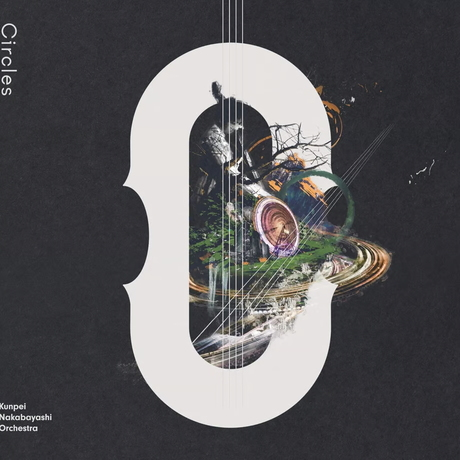 | 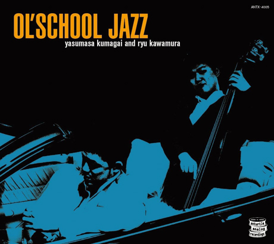 | 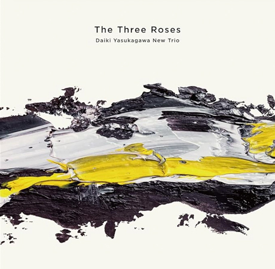

-   *[Bass on Cinema](https://www.jazzofjapan.com/p/shinichi-kato-bass-on-cinema)* by Shinichi Kato
-   *[Bass on Times](https://www.jazzofjapan.com/p/satoshi-kosugi-bass-on-times)* by Satoshi Kosugi
-   *[By Coincidence](https://www.jazzofjapan.com/p/yoshihito-p-koizumi-by-coincidence)* by Yoshihito “P” Koizumi P-Project
-   *[Circles](https://www.jazzofjapan.com/p/kunpei-nakabayashi-orchestra-circles)* by Kunpei Nakabayashi Orchestra \*
-   *[Duet](https://www.jazzofjapan.com/p/shinichi-kato-and-masahiko-sato-duet)* by Shinichi Kato & Masahiko Sato
-   *[Kanmai](https://www.jazzofjapan.com/p/daiki-yasukagawa-trio-kanmai)* by Daiki Yasukagawa Trio
-   *[My Soul Meeting](https://www.jazzofjapan.com/p/motoi-kanamori-my-soul-meeting)* by Motoi Kanamori
-   *[Nijuso](https://www.jazzofjapan.com/p/hideaki-kanazawa-sumire-kuribayashi-nijuso)* by Hideaki Kanazawa & Sumire Kuribayashi
-   *[Ol’ School Jazz](https://www.jazzofjapan.com/p/yasumasa-kumagai-ryu-kawamura-ol-school-jazz)* by Yasumasa Kumagai & Ryu Kawamura
-   *[Path of Hope](https://www.jazzofjapan.com/p/minoru-yoshiki-soulstation-path-of-hope)* by Minoru Yoshiki Soulstation
-   *[Retattanni no Mori](https://www.jazzofjapan.com/p/yuki-ito-retattanni-no-mori)* by Yuki Ito *(solo)*
-   *[The Live](https://www.jazzofjapan.com/p/motoi-kanamori-the-live)* by Motoi Kanamori
-   *[The Three Roses](https://www.jazzofjapan.com/p/daiki-yasukagawa-new-trio-three-roses)* by Daiki Yasukagawa New Trio
-   *[Trios II](https://www.jazzofjapan.com/p/daiki-yasukagawa-trio-trios-ii)* by Daiki Yasukagawa Trio
-   *See all: [#bass](https://www.jazzofjapan.com/t/bass)*

## 12. Drums

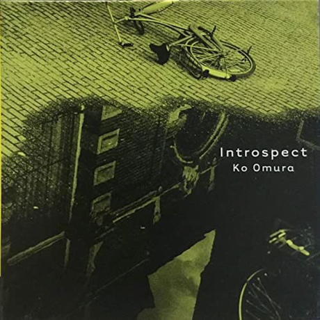 | 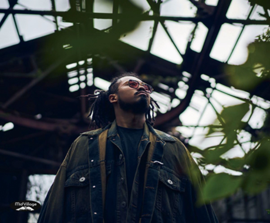 | 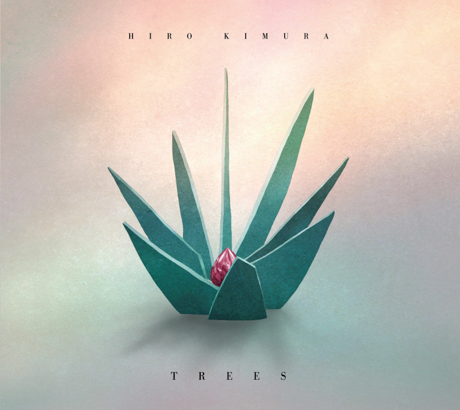

-   *[Folds](https://www.jazzofjapan.com/p/hiro-kimura-quintet-folds)* by Hiro Kimura Quintet
-   *[For 2 Akis](https://www.jazzofjapan.com/p/shinya-fukumori-trio-for-2-akis)* by Shinya Fukumori Trio *(free/experimental)* \*
-   *[Halo](https://www.jazzofjapan.com/p/blue-dot-halo)* by Blue Dot
-   *[Introspect](https://www.jazzofjapan.com/p/ko-omura-introspect)* by Ko Omura
-   *[Invisible Diary](https://www.jazzofjapan.com/p/kaito-nakamura-invisible-diary)* by Kaito Nakamura
-   *[Niwatazumi](https://www.jazzofjapan.com/p/kazumi-ikenaga-niwatazumi)* by Kazumi Ikenaga
-   *[NordNote](https://www.jazzofjapan.com/p/kazumi-ikenaga-taihei-asakawa-nordnote)* by Kazumi Ikenaga & Taihei Asakawa
-   *[Rin](https://www.jazzofjapan.com/p/sohnosuke-imaizumi-rin)* by Sohnosuke Imaizumi
-   *[Routine Jazz Sextet](https://www.jazzofjapan.com/p/routine-jazz-sextet-routine-jazz-sextet)* by Routine Jazz Sextet
-   *[Sumitty & The Funfair](https://www.jazzofjapan.com/p/sumito-oi-sumitty-and-the-funfair)* by Sumito Oi
-   *[Trees](https://www.jazzofjapan.com/p/hiro-kimura-trees)* by Hiro Kimura
-   *[You’ve Changed](https://www.jazzofjapan.com/p/hara-dairiki-trio-youve-changed)* by Hara Dairiki Trio
-   *See all: [#drums](https://www.jazzofjapan.com/t/drums)*

## 13. Vocals

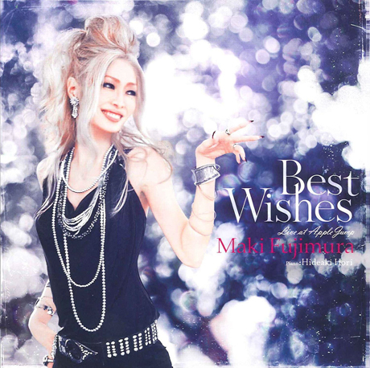 | 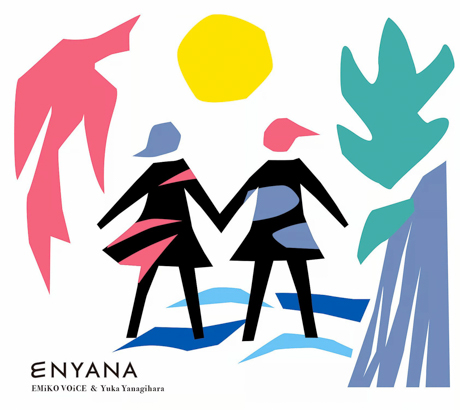 | 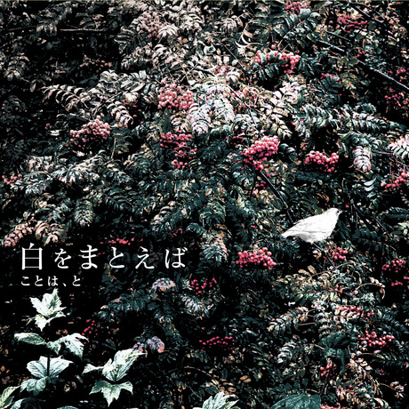

-   *[A Tempo](https://www.jazzofjapan.com/p/meu-coracao-a-tempo)* by Meu Coracao *(Brazilian/Latin jazz)*
-   *[Agora](https://www.jazzofjapan.com/p/yuka-ueda-agora)* by Yuka Ueda *(Brazilian/Latin jazz)*
-   *[Almost Like Being in Love](https://www.jazzofjapan.com/p/azumi-almost-like-being-in-love)* by Azumi
-   *[Back in Time to Boston](https://www.jazzofjapan.com/p/yoshiko-saita-back-in-time-to-boston)* by Yoshiko Saita
-   *[Bb](https://www.jazzofjapan.com/p/baby-brothers-bb)* by Baby Brothers
-   *[Best Wishes](https://www.jazzofjapan.com/p/maki-fujimura-best-wishes)* by Maki Fujimura
-   *[Blossoms](https://www.jazzofjapan.com/p/ruriko-kawamura-blossoms)* by Ruriko Kawamura
-   *[Bénin Rio Tokyo](https://www.jazzofjapan.com/p/nobie-benin-rio-tokyo)* by Nobie *(Brazilian/Latin jazz)*
-   *[Carta](https://www.jazzofjapan.com/p/emiko-voice-carta)* by Emiko Voice
-   *[Colors in Silence](https://www.jazzofjapan.com/p/tomoka-miwa-colors)* by Tomoka Miwa
-   *[Dois](https://www.jazzofjapan.com/p/yuka-ueda-dois)* by Yuka Ueda *(Brazilian/Latin jazz)*
-   *[Enyana](https://www.jazzofjapan.com/p/emiko-voice-yuka-yanagihara-enyana)* by Emiko Voice & Yuka Yanagihara *(Brazilian/Latin jazz)*
-   *[Etrenne](https://www.jazzofjapan.com/p/mie-joke-etrenne)* by Mie Joké
-   *[Faces](https://www.jazzofjapan.com/p/kaoru-azuma-hitomi-nishiyama-faces)* by Kaoru Azuma / Hitomi Nishiyama
-   *[Feel Like Makin’ Love](https://www.jazzofjapan.com/p/sanae-ishikawa-feel-like-makin-love)* by Sanae Ishikawa
-   *[Fever](https://www.jazzofjapan.com/p/trigraph-fever)* by Trigraph
-   *[Flowers On The Hill](https://www.jazzofjapan.com/p/akiko-suda-flowers-on-the-hill)* by Akiko Suda
-   *[Grown-up Christmas Gift](https://www.jazzofjapan.com/p/sanae-ishikawa-grown-up-christmas)* by Sanae Ishikawa
-   *[Hall Tone](https://www.jazzofjapan.com/p/meu-coracao-hall-tone)* by Meu Coracao *(Brazilian/Latin jazz)*
-   *[Happy Christmas with Bb](https://www.jazzofjapan.com/p/baby-brothers-happy-christmas-with-bb)* by Baby Brothers
-   *[Les Komatis](https://www.jazzofjapan.com/p/les-komatis-les-komatis)* by Les Komatis
-   *[Luar](https://www.jazzofjapan.com/p/sul-madrugada-luar)* by Sul Madrugada *(Brazilian/Latin jazz)*
-   *[M](https://www.jazzofjapan.com/p/masako-kunisada-m)* by Masako Kunisada
-   *[Music Make Us One](https://www.jazzofjapan.com/p/yuichiro-aratake-music-make-us-one)* by Yuichiro Aratake
-   *[No One Else](https://www.jazzofjapan.com/p/naoko-akimoto-no-one-else)* by Naoko Akimoto
-   *[Okurimono](https://www.jazzofjapan.com/p/hiroco-nagano-okurimono)* by Hiroco Nagano
-   *[Owari to Hajimari](https://www.jazzofjapan.com/p/nobie-takayoshi-baba-owari-to-hajimari)* by Nobie & Takayoshi Baba *(Brazilian/Latin jazz)*
-   *[Phase 2](https://www.jazzofjapan.com/p/emiko-voice-x-suga-dairo-phase-2)* by Emiko Voice x Suga Dairo
-   *[Primary](https://www.jazzofjapan.com/p/nobie-primary)* by Nobie
-   *[Shining Hour](https://www.jazzofjapan.com/p/yako-horikita-shining-hour)* by Yako Horikita
-   *[Shiro o Matoeba](https://www.jazzofjapan.com/p/koto-ha-to-shiro-o-matoeba)* by Koto ha, To \*
-   *[Standard Trio](https://www.jazzofjapan.com/p/emiko-voice-standard-trio)* by Emiko Voice *(Brazilian/Latin jazz)*
-   *[Stolen Moments](https://www.jazzofjapan.com/p/layla-tomomi-sakai-stolen-moments)* by Layla Tomomi Sakai
-   *[The Gift](https://www.jazzofjapan.com/p/rie-taguchi-gift)* by Rie Taguchi
-   *[The Gift II](https://www.jazzofjapan.com/p/rie-taguchi-the-gift-ii)* by Rie Taguchi
-   *[The Island](https://www.jazzofjapan.com/p/layla-tomomi-sakai-island)* by Layla Tomomi Sakai
-   *[This is Atomi](https://www.jazzofjapan.com/p/atomi-hamada-this-is-atomi)* by Atomi Hamada
-   *[Tranquillo](https://www.jazzofjapan.com/p/miwo-tranquillo)* by Miwo
-   *[Tsutaete Ikou](https://www.jazzofjapan.com/p/seiji-endo-tsutaete-ikou)* by Seiji Endo
-   *[Virtual Silence](https://www.jazzofjapan.com/p/chie-nishimura-virtual-silence)* by Chie Nishimura
-   *[Water Me!](https://www.jazzofjapan.com/p/water-me-water-me)* by Water Me!
-   *[Whisper Not](https://www.jazzofjapan.com/p/layla-tomomi-sakai-whisper-not)* by Layla Tomomi Sakai
-   *[Wonderful Life](https://www.jazzofjapan.com/p/masako-kunisada-wonderful-life)* by Masako Kunisada
-   *See all: [#vocals](https://www.jazzofjapan.com/t/vocals)*

    *: latest article in category

